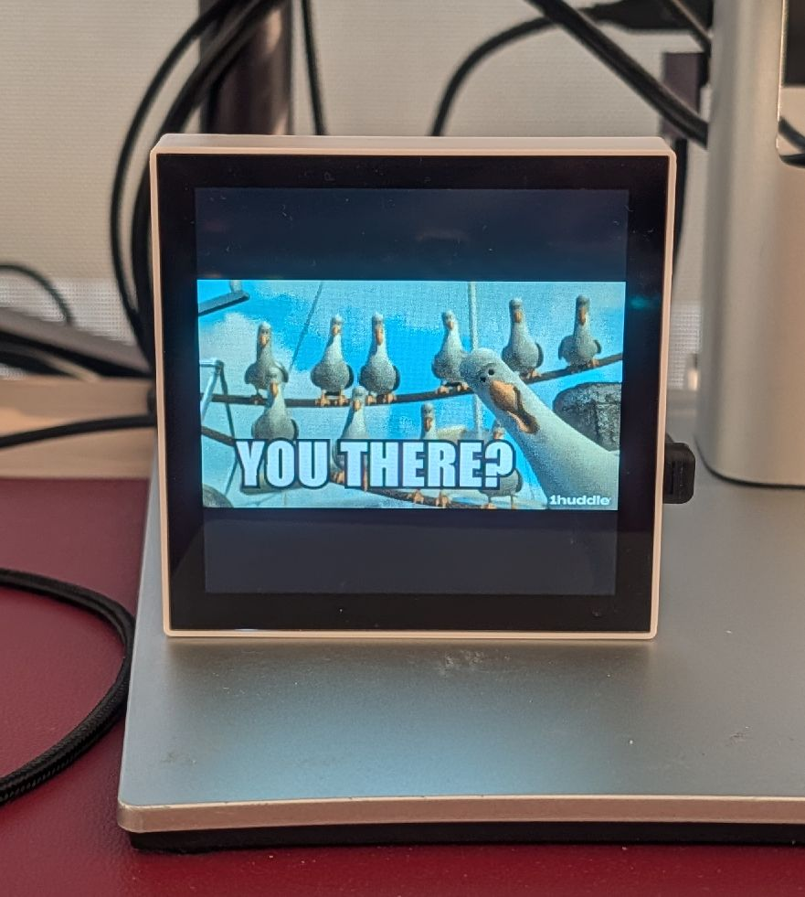
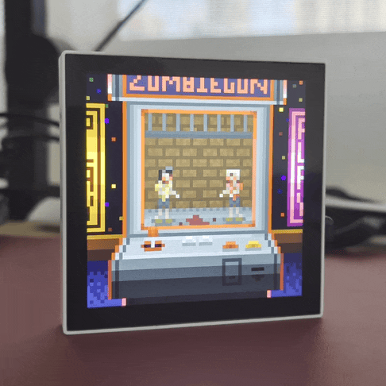
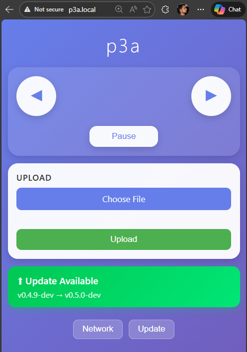
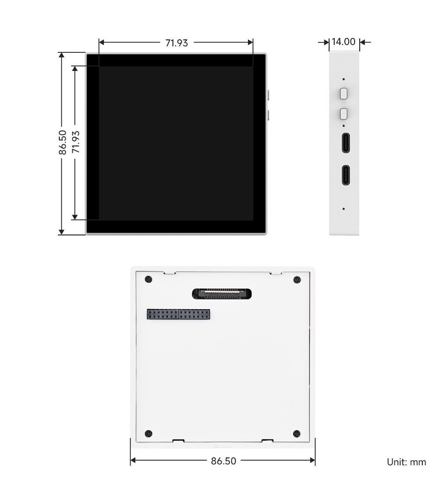

# p3a — Pixel Art Player

p3a is a Wi-Fi pixel art player built on the ESP32-P4. It's a 4-inch smart art frame that plays animated GIFs from [Giphy](https://giphy.com/), artworks from [Makapix Club](https://makapix.club/) (a pixel art social network), and your own files—all from one tiny device you can control via touchscreen, web browser, REST API, or securely from anywhere through Makapix Club's MQTTS backend.
> **Join the community:** Connect with other p3a users and discuss pixel art on the [Makapix Club Discord](https://discord.gg/xk9umcujXV).

## Photos

  
  
  
  

## Quick start

1. **Get the hardware**:
    - [Waveshare ESP32-P4-WIFI6-Touch-LCD-4B](https://www.waveshare.com/product/arduino/boards-kits/esp32-p4/esp32-p4-wifi6-touch-lcd-4b.htm?sku=31416)
    - [microSD card](https://www.waveshare.com/micro-sd-card-16gb-kawau.htm?sku=18191)
    - USB-C cable
    - a small screwdriver
3. **Insert the microSD card**: This requires unscrewing the back plate
4. **Flash the firmware**: Visit the [p3a Web Flasher](https://fabkury.github.io/p3a/web-flasher/) — just connect your device and click to flash. No software installation needed. See the [flashing guide](docs/flash-p3a.md) for alternative methods.
5. **Connect to Wi-Fi**: On first boot, connect to the `p3a-setup` network and visit http://p3a.local/ to configure your Wi-Fi
6. **Register it at Makapix Club**: Long press on the screen and follow the instructions
7. **Play art on it**: Enable [Giphy](https://giphy.com/) trending GIFs from the web UI, browse https://makapix.club/ to send artworks, or copy your own files via USB

> **Note:** The initial flash requires USB and a laptop or desktop (does not work on a smartphone). After that, all updates are wireless via the web UI.

For detailed usage instructions, see [HOW-TO-USE.md](docs/HOW-TO-USE.md).

## Features

### Giphy Integration

- **Trending GIFs on your desk**: p3a fetches trending GIFs directly from the [Giphy](https://giphy.com/) API and plays them in a continuous loop — animated memes, reactions, and pop culture moments cycling on your display all day long
- **Configurable content**: Choose your preferred rendition size, file format (WebP or GIF), and content rating (G through R) from the built-in Giphy settings page
- **Automatic refresh**: p3a periodically checks Giphy for fresh trending content so the feed stays current without any manual intervention
- **Mix and match**: Combine Giphy channels with Makapix artwork channels in the same playset for a varied, ever-changing display

### Makapix Club Integration

- **Play artworks and channels**: Play individual artworks or entire channels (e.g., "Promoted Artworks", "Recent Artworks") directly from [Makapix Club](https://makapix.club/) to your p3a
- **4 ways to control**: Touchscreen, local web UI at `http://p3a.local/`, REST API, or remotely via Makapix Club's secure MQTTS (MQTT over TLS) backend
- **Cloud connectivity**: Register your device at [makapix.club](https://makapix.club/) to unlock remote control from anywhere
- **Join the community**: Connect with other p3a users and discuss pixel art players on the [Makapix Club Discord](https://discord.gg/xk9umcujXV)
- **Coming soon**: Send a "like" to the artwork by touching the screen, swipe up to view artwork comments from the Makapix community

### Seamless Playback

- **Freeze-free, gapless playback**: Robust multi-buffer rendering handles animations smoothly, even with corrupt or problematic files
- **Full format support**: Animated WebP and GIF, and still PNG all with transparency and alpha channel support, plus hardware-accelerated JPEG support
- **Aspect ratio preservation**: Non-square artworks display without distortion, properly centered with configurable background color

### Control & Customization

- **Touch controls**: Tap to change artwork, swipe to adjust brightness, rotate with two fingers
- **Screen rotation**: Rotate the display 0°, 90°, 180°, or 270° via touch gesture or web API
- **Web interface**: Full device control from any browser at `http://p3a.local/` (only accessible in LAN, not Internet)
- **Over-the-Air updates**: After initial USB flash, update firmware wirelessly via the web UI with automatic rollback protection

### Hardware & Connectivity

- **USB access**: Connect via USB-C to access the microSD card as a storage device. Copy you own private, offline files to p3a
- **Auto co-processor updates**: p3a automatically flashes the ESP32-C6 Wi-Fi 6 co-processor firmware when needed
- **PICO-8 Monitor**: Stream PICO-8 games to the display via Wi-Fi

  

## Over-the-Air Updates

After the initial firmware flash via USB-C cable, all subsequent updates can be installed wirelessly. p3a automatically checks for firmware updates from GitHub Releases, and you can install them directly from the web interface.

**Update features:**
- **Wireless updates** — no need to reconnect USB after the first flash
- **Automatic checks** every 2 hours (or check manually via web UI)
- **One-click install** from the web interface at `http://p3a.local/ota`
- **Progress display** on both the device screen and web interface
- **Automatic rollback** if the new firmware fails to boot 3 times
- **Manual rollback** to previous version via web UI
- **SHA256 verification** ensures firmware integrity
- **ESP32-C6 auto-update** — the Wi-Fi co-processor firmware is updated automatically when needed
- **Web UI updates** — starting with v0.7.5, the web interface can also be updated over-the-air

> **Note:** Version 0.7.5 requires a full flash (use the [web flasher](https://fabkury.github.io/p3a/web-flasher/) or see [alternative methods](docs/flash-p3a.md)). This version adds OTA updates for the web UI, so future updates should rarely require a full flash.

  
   
  <em>OTA update page (click image to watch video)</em>

## Hardware specs

| Component | Details |
|-----------|---------|
| **Board** | [Waveshare ESP32-P4-WIFI6-Touch-LCD-4B](https://www.waveshare.com/product/arduino/boards-kits/esp32-p4/esp32-p4-wifi6-touch-lcd-4b.htm?sku=31416) |
| **MCU** | Dual-core ESP32-P4 + ESP32-C6 for Wi-Fi 6/BLE |
| **Display** | 4" square 720×720 IPS, 24-bit color, dimmable backlight |
| **Touch** | 5-point capacitive touchscreen |
| **Memory** | 32MB PSRAM, 32MB flash |
| **Storage** | microSD card slot |
| **Power** | USB-C (no battery) |

  

## Current status

p3a is in active development. The following features are implemented:

- Display pipeline with multi-buffer rendering for freeze-free playback
- Animation playback with prefetching and robust error handling
- **Transparency & alpha channel support** for WebP, GIF, and PNG with configurable background color
- **Aspect ratio preservation** for non-square artworks
- Touch gestures (tap, swipe, long-press, two-finger rotation)
- Screen rotation (0°, 90°, 180°, 270°) with persistence
- Wi-Fi provisioning with captive portal and mDNS (http://p3a.local/)
- Local web UI and REST API, also with mDNS
- **Giphy integration** — play trending GIFs from [Giphy](https://giphy.com/) with configurable content rating, rendition, and format
- **Makapix Club integration** — play individual artworks and entire channels from [makapix.club](https://makapix.club/)
- **Secure mTLS MQTT client** for device registration and remote control
- **Over-the-Air (OTA) updates** — install firmware updates wirelessly via web UI with integrity verification and full rollback support
- **Automatic ESP32-C6 firmware updates** for the Wi-Fi co-processor
- USB composite device (serial console + mass storage)

**Coming soon:**
- Send "likes" to artworks with long-press gesture
- Swipe up to view artwork comments from the Makapix community

See [ROADMAP.md](docs/ROADMAP.md) for the full development plan.

## Troubleshooting

If your device is crashing or behaving unexpectedly, try changing the **root directory** in the web UI settings. The default is `/p3a`. Changing this creates a fresh directory with new index files, which can resolve issues caused by corrupted data. You can always switch back to the original directory later.

## Documentation

| Document | Description |
|----------|-------------|
| [HOW-TO-USE.md](docs/HOW-TO-USE.md) | Detailed usage instructions |
| [flash-p3a.md](docs/flash-p3a.md) | How to flash the firmware |
| [OTA_IMPLEMENTATION_PLAN.md](docs/OTA_IMPLEMENTATION_PLAN.md) | Over-the-Air update system design |
| [INFRASTRUCTURE.md](docs/INFRASTRUCTURE.md) | Technical architecture for developers |
| [ROADMAP.md](docs/ROADMAP.md) | Development roadmap and milestones |

## Repository layout

- `main/` — Application entry point, display/touch drivers, animation player, format decoders
- `components/` — Custom components: app state, config store, HTTP API, Makapix integration, OTA manager, decoders
- `managed_components/` — ESP-IDF Component Registry dependencies
- `webui/` — Web interface files (compiled into SPIFFS)
- `docs/` — Documentation

## Makapix Club integration

[Makapix Club](https://makapix.club/) is a pixel-art social network where artists share their creations. Register your p3a at [makapix.club](https://makapix.club/) to:

- **Play artworks and channels**: Stream individual artworks or entire channels (like "Promoted Artworks" or "Recent Artworks") directly to your p3a
- **Remote control**: Control your device from anywhere via secure MQTTS (MQTT over TLS) connection
- **Real-time updates**: Receive artwork notifications instantly
- **Coming soon**: Send "likes" to artworks with a long-press, swipe up to view community comments

**Join the discussion**: Visit the [Makapix Club Discord](https://discord.gg/xk9umcujXV) to connect with other p3a users, share tips, and discuss pixel art players integrated with Makapix Club.

## License

p3a is licensed under the Apache License 2.0. See [LICENSE](LICENSE) for the full license text.

For detailed information about all dependencies and their licenses, see [LICENSING.md](LICENSING.md).

## Contributing

Contributions are welcome! By contributing to p3a, you agree that your contributions will be licensed under the Apache License 2.0.

See the [INFRASTRUCTURE.md](docs/INFRASTRUCTURE.md) for technical details about the codebase.

## Acknowledgements

Thanks to ByteWelder from the *Espressif MCUs* Discord channel for advice very early in the p3a project.
