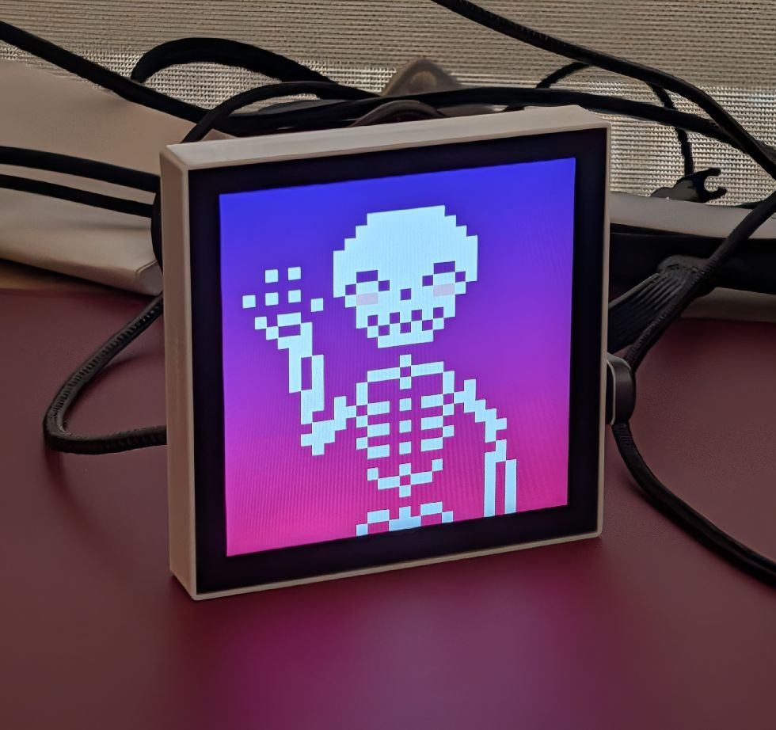
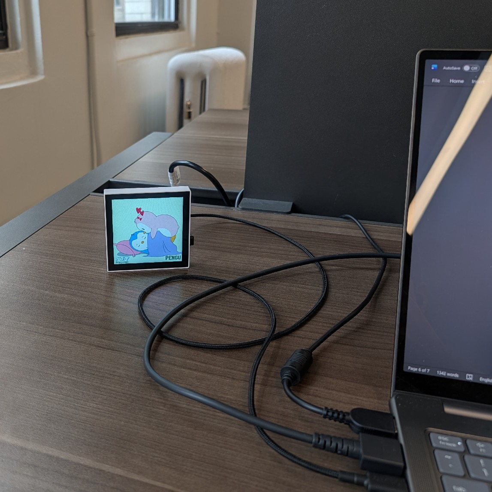
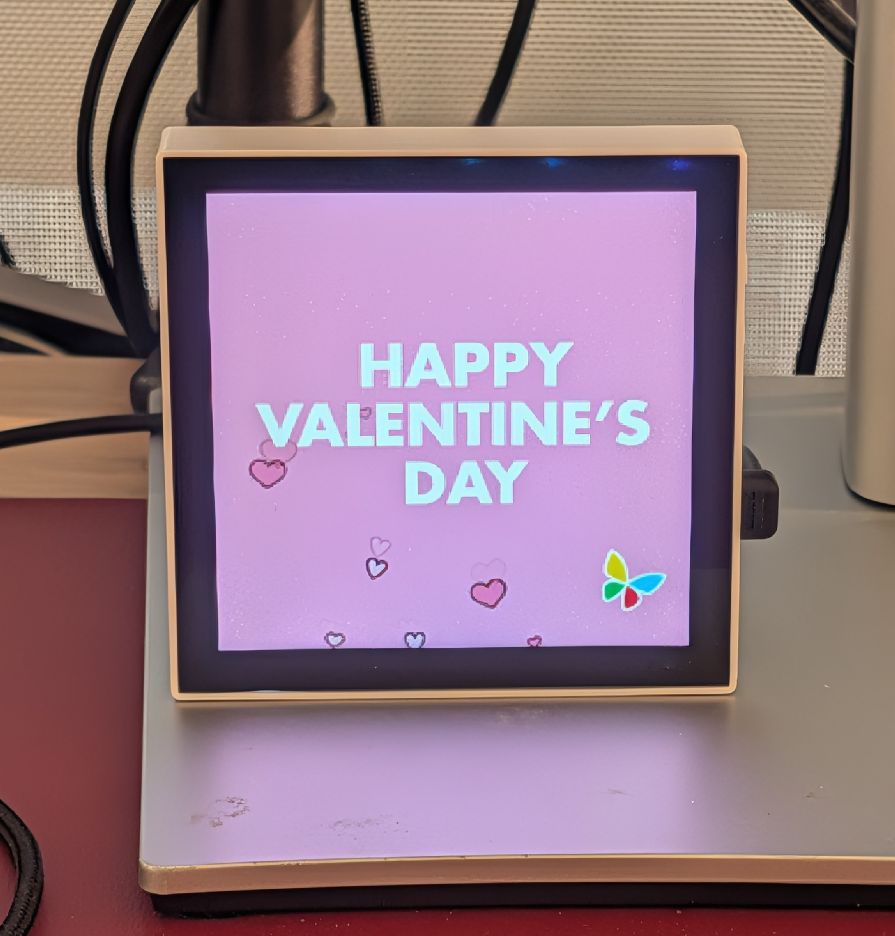
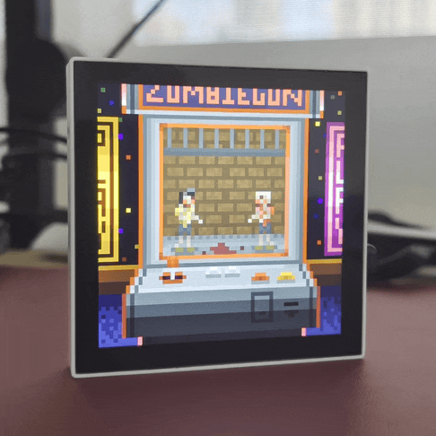
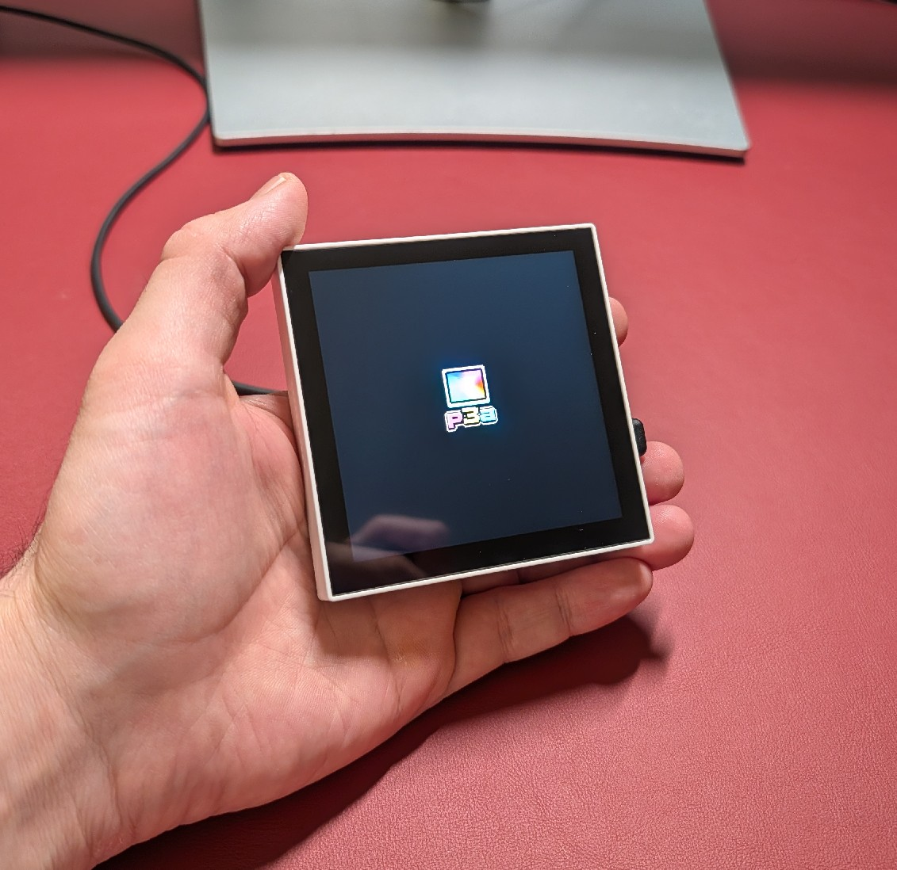
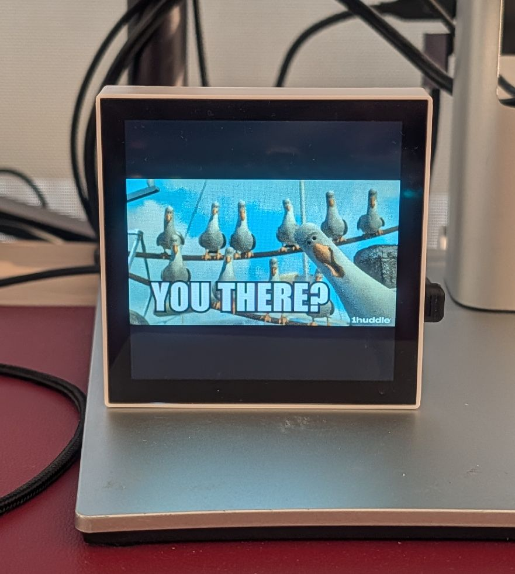
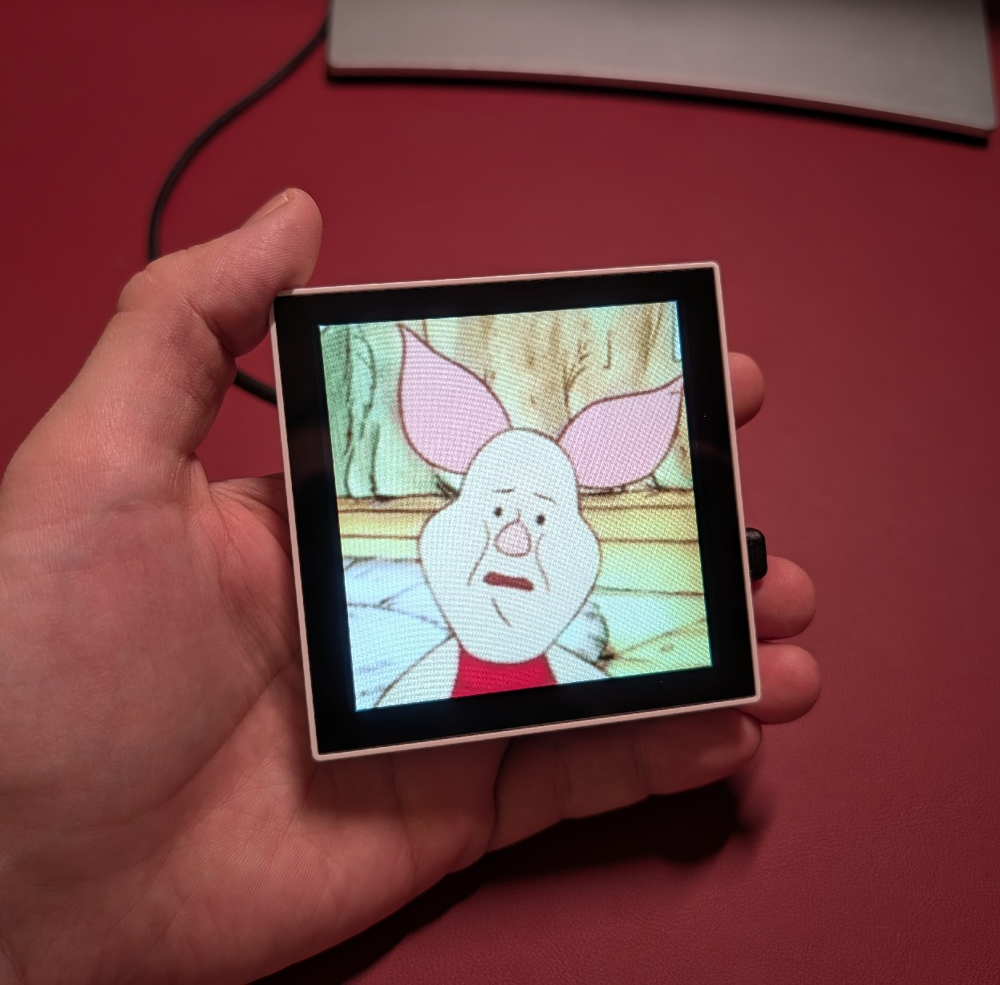
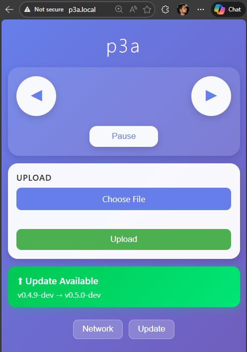
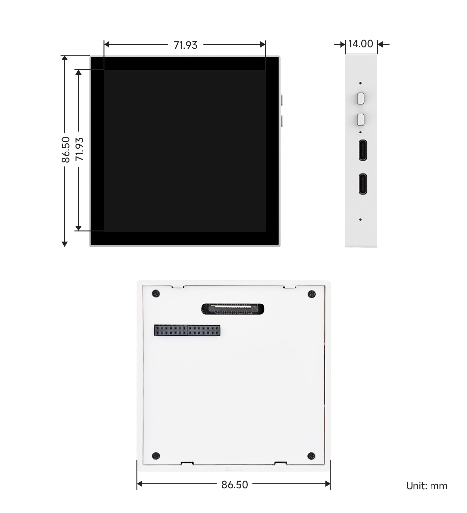
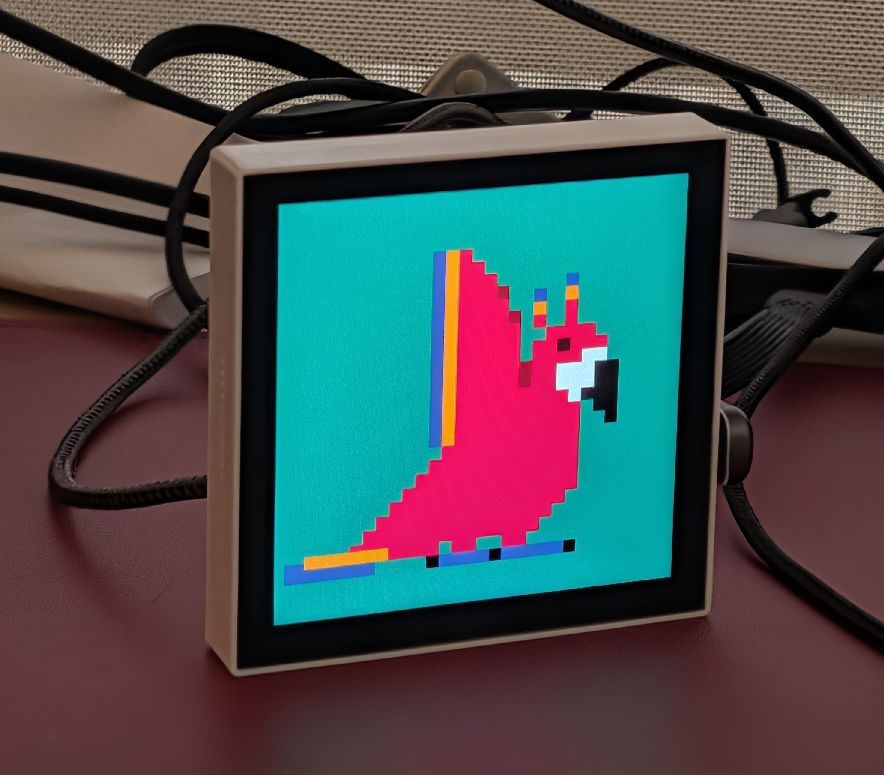

# p3a — Pixel Art Player

**An open-source, Wi-Fi-connected pixel art player built on the ESP32-P4.**
Plays animated artworks from [Makapix Club](https://makapix.club/), trending GIFs from [Giphy](https://giphy.com/), and your own files — on a 4-inch 720x720 IPS display you control by touch, web browser, or from REST API.

<br clear="left"/>

<p align="center">
  
  &nbsp;
  
  &nbsp;
  
</p>

<p align="center">
  <a href="https://discord.gg/xk9umcujXV"></a>&nbsp;
  <a href="LICENSE"></a>&nbsp;
  <a href="https://github.com/fabkury/p3a/releases"></a>
</p>

---

## What Is p3a?

p3a turns a small ESP32-P4 development board into a desk-sized animated art display. Think of it as a 4-inch digital picture frame — but instead of static photos, it plays animated pixel art, trending GIFs, and anything else you throw at it.

It connects to Wi-Fi, so you can send it new artwork from the [Makapix Club](https://makapix.club/) pixel art community, let it cycle through [Giphy](https://giphy.com/) trending content, or simply load your own files via USB or Wi-Fi. Everything is controlled from the touchscreen, a local web interface, a REST API, or remotely through Makapix Club's secure cloud backend.

<p align="center">
  
</p>

---

## Quick Start

**What you need:**
- [Waveshare ESP32-P4-WIFI6-Touch-LCD-4B](https://www.waveshare.com/product/arduino/boards-kits/esp32-p4/esp32-p4-wifi6-touch-lcd-4b.htm?sku=31416) board
- [microSD card](https://www.waveshare.com/micro-sd-card-16gb-kawau.htm?sku=18191)
- USB-C data cable
- A small screwdriver

**Setup steps:**

1. **Insert the microSD card** (requires unscrewing the back plate)
2. **Flash the firmware** using the [p3a Web Flasher](https://fabkury.github.io/p3a/web-flasher/) — connect, click, done. No software to install. ([Alternative methods](docs/flash-p3a.md))
3. **Connect to Wi-Fi** — on first boot, join the `p3a-setup` network and configure your Wi-Fi at `http://p3a.local/`
4. **Start playing art** — add a [Giphy API key](https://developers.giphy.com/) for trending GIFs, browse [makapix.club](https://makapix.club/) to send artworks, or copy your own files via USB

> The initial flash requires a computer with USB. After that, all updates are wireless.

For full usage instructions, see [HOW-TO-USE.md](docs/HOW-TO-USE.md).

---

## Features

### Three Sources of Content

| Source | What it does |
|--------|-------------|
| **[Makapix Club](https://makapix.club/)** | Browse a pixel art social network and send artworks directly to your p3a. Play entire channels like "Promoted Artworks" or "Recent Artworks." Control your device remotely from anywhere. |
| **[Giphy](https://giphy.com/)** | Automatically fetches and cycles through trending GIFs. Configurable content rating, format, resolution, and refresh interval. |
| **Local files** | Copy your own WebP, GIF, PNG, or JPEG files via USB or via Wi-Fi. They play alongside cloud content or on their own. |

Mix all three in a single playlist for an ever-changing display.

<p align="center">
  
  &nbsp;
  
  &nbsp;
  
</p>

### Smooth, Gapless Playback

- **Animated WebP, GIF, PNG, and JPEG** — with full transparency and alpha channel support
- **Hardware-accelerated scaling** — bilinear interpolation for Giphy; nearest-neighbor for pixel art to keep edges crisp
- **Triple-buffered rendering** with VSYNC — no tearing, no freezing, even with problematic files
- **Aspect ratio preservation** — non-square art is centered on the display with a configurable background color

### Four Ways to Control

| Method | Scope |
|--------|-------|
| **Touchscreen** | Tap to change art, swipe for brightness, two-finger rotate |
| **Web UI** | Full dashboard at `http://p3a.local/` (LAN only) |
| **REST API** | JSON endpoints for scripting and automation |
| **Makapix Club** | Remote control from anywhere via secure MQTTS |

### Wireless Updates

After the first USB flash, everything is over-the-air:
- One-click install of update from the web UI, with progress shown on both screen and browser
- Automatic rollback if the new firmware fails to boot
- Web UI itself is also separately updatable over the air
- ESP32-C6 co-processor firmware updates automatically when needed

<p align="center">
  <a href="images/PXL_20251206_184110573_red.mp4">
    
  </a>
  <br>
  <em>OTA update page (click to watch video)</em>
</p>

### PICO-8 Game Streaming

Stream [PICO-8](https://www.lexaloffle.com/pico-8.php) games to the display over Wi-Fi. A WebAssembly emulator runs in your browser and sends frames at 30 FPS to the device, upscaled to 720x720. The display returns to artwork playback after 30 seconds of inactivity.

<p align="center">
  
</p>

---

## Hardware

p3a runs on the **Waveshare ESP32-P4-WIFI6-Touch-LCD-4B**, an off-the-shelf development board:

| Component | Details |
|-----------|---------|
| **MCU** | Dual-core ESP32-P4 + ESP32-C6 co-processor (Wi-Fi 6 / BLE) |
| **Display** | 4" 720x720 IPS, 24-bit color, dimmable backlight |
| **Touch** | 5-point capacitive (GT911) |
| **Memory** | 32 MB PSRAM, 32 MB flash |
| **Storage** | microSD card slot |
| **Power** | USB-C (no battery needed) |

<p align="center">
  
</p>

---

## Makapix Club

<p align="center">
  
</p>

[Makapix Club](https://makapix.club/) is a pixel art social network where artists share animated creations. Register your p3a to unlock:

- **Browse and send** artworks or entire channels directly to your device
- **Remote control** from any browser — change artwork, adjust brightness, pause/resume
- **Secure connection** via mutual TLS (mTLS) with per-device certificates
- **Coming soon** — like artworks from the touchscreen, view community comments

**To register:** long-press the touchscreen to get a 6-character code, then enter it at [makapix.club](https://makapix.club/). The device connects automatically via encrypted MQTT.

> [Join the Makapix Club Discord](https://discord.gg/xk9umcujXV) to connect with other p3a users and the pixel art community.

---

## Documentation

| Document | Description |
|----------|-------------|
| [HOW-TO-USE.md](docs/HOW-TO-USE.md) | Full user guide — setup, touch controls, Wi-Fi, web UI, REST API, Giphy, PICO-8 |
| [flash-p3a.md](docs/flash-p3a.md) | Flashing instructions (web flasher and alternatives) |
| [INFRASTRUCTURE.md](docs/INFRASTRUCTURE.md) | Technical architecture for developers and contributors |

---

## Project Structure

```
main/               Application core — boot, display, animation player, decoders
components/          Custom ESP-IDF components — state machine, HTTP API, OTA,
                     Makapix integration, Giphy, config store, Wi-Fi manager
managed_components/  Third-party ESP-IDF dependencies
webui/               Web interface (served from LittleFS)
docs/                Documentation
```

**Storage layout on device:**
- **LittleFS** `/webui` (4 MB) — web UI assets
- **SD card** `/sdcard/p3a/animations/` — local files; `/sdcard/p3a/vault/` — cached Makapix art; `/sdcard/p3a/giphy/` — cached Giphy content
- **NVS** (24 KB) — Wi-Fi credentials, settings, device state

---

## Contributing

Contributions are welcome. By contributing, you agree that your work will be licensed under the Apache License 2.0.

Start with [INFRASTRUCTURE.md](docs/INFRASTRUCTURE.md) for technical details about the codebase.

## License

Apache License 2.0 — see [LICENSE](LICENSE). For dependency licenses, see [LICENSING.md](LICENSING.md).

## Acknowledgements

Thanks to ByteWelder from the *Espressif MCUs* Discord channel for advice in the early days of p3a.
