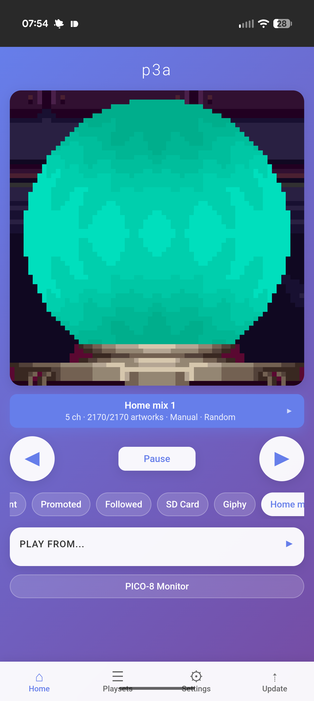

# p3a — Pixel Art Player

**A 4-inch smart art frame powered by ESP32-P4.** Plays animated pixel art from [Makapix Club](https://makapix.club/), trending GIFs from [Giphy](https://giphy.com/), and your own files on a 24-bit 720x720 IPS touchscreen you control from anywhere.

<br clear="left"/>

<p align="center">
  
  &nbsp;
  
  &nbsp;
  
</p>

<p align="center">
  <a href="https://discord.gg/xk9umcujXV"></a>&nbsp;
  <a href="LICENSE"></a>&nbsp;
  <a href="https://github.com/fabkury/p3a/releases"></a>
</p>

<p align="center">
  <a href="https://discord.gg/xk9umcujXV"><strong>Discord</strong></a> · <a href="https://makapix.club/"><strong>Makapix Club</strong></a> · <a href="docs/HOW-TO-USE.md"><strong>User Guide</strong></a> · <a href="https://fabkury.github.io/p3a/web-flasher/"><strong>Web Flasher</strong></a>
</p>

---

## What Is p3a?

p3a turns a [$40 development board](https://www.waveshare.com/product/arduino/boards-kits/esp32-p4/esp32-p4-wifi6-touch-lcd-4b.htm?sku=31416) into a dedicated pixel art display. Think of it as a tiny gallery on your desk — it cycles through artworks automatically, picks up trending GIFs throughout the day, and lets users send artworks directly to it from [Makapix Club](https://makapix.club/), a pixel art social network.

It's open source, self-contained, and designed to be as simple to use as a picture frame — while still exposing a full REST API for those who want to automate and tinker.

<p align="center">
  
</p>

---

## Quick Start

**What you need:**
- [Waveshare ESP32-P4-WIFI6-Touch-LCD-4B](https://www.waveshare.com/product/arduino/boards-kits/esp32-p4/esp32-p4-wifi6-touch-lcd-4b.htm?sku=31416) board ($39.99)
- [microSD card](https://www.waveshare.com/micro-sd-card-16gb-kawau.htm?sku=18191) ($7.99)
- USB-C data cable
- A small screwdriver

**Setup steps:**

1. **Insert the microSD card** (requires unscrewing the back plate)
2. **Flash the firmware** using the [p3a Web Flasher](https://fabkury.github.io/p3a/web-flasher/) — connect, click, done. No software to install. ([Alternative methods](docs/flash-p3a.md))
3. **Connect to Wi-Fi** — on first boot, join the `p3a-setup` network and configure your Wi-Fi at `http://p3a.local/`
4. **Start playing art** — add a [Giphy API key](https://developers.giphy.com/) for trending GIFs, register at [makapix.club](https://makapix.club/) to send artworks, or copy your own files via USB

> The initial flash requires a computer with USB. After that, all updates are wireless.

For full usage instructions, see [HOW-TO-USE.md](docs/HOW-TO-USE.md).

---

## Features

### Three Sources of Content

| Source | What it does |
|--------|-------------|
| **[Makapix Club](https://makapix.club/)** | Browse a pixel art social network and send artworks directly to your p3a. Play entire channels like "Promoted Artworks" or "#nintendo" Control your device remotely from anywhere. |
| **[Giphy](https://giphy.com/)** | Automatically fetches and cycles through trending GIFs. Configurable content rating (G through R) and refresh interval. |
| **Local files** | Copy your own WebP, GIF, PNG, or JPEG files via USB or Wi-Fi. No cloud account needed, no internet required. |

Mix all three in a single "playset" for an ever-changing display.

<p align="center">
  
  &nbsp;
  
  &nbsp;
  
</p>

### Smooth, Gapless Playback

- **Animated WebP, GIF, PNG, and JPEG** — with full transparency and alpha channel support
- **Smart upscaling** — pixel art uses nearest-neighbor scaling to keep edges crisp; Giphy content uses hardware-accelerated bilinear interpolation for smooth results
- **Triple-buffered rendering** with VSYNC — no tearing, no freezing, even with problematic files
- **Aspect ratio preservation** — non-square art is centered on the display with a configurable background color
- **Auto-advance** — cycles to a new artwork every 30 seconds (configurable)

### Touch Controls

| Gesture | Action |
|---------|--------|
| Tap right half | Next artwork |
| Tap left half | Previous artwork |
| Swipe up / down | Adjust brightness |
| Two-finger rotate | Rotate screen (0° / 90° / 180° / 270°) |
| Long press | Start device registration |

All controls are also available via the web UI and REST API.

### Web Interface & REST API

Open `http://p3a.local/` from any browser on the same Wi-Fi network for a full dashboard — playback controls, configuration, firmware updates, Giphy settings, and more.

<p align="center">
  
  <br>
  <em>p3a web UI: control everything from the browser</em>
</p>

Every action is also exposed as a JSON API endpoint for scripting and automation.

```bash
curl http://p3a.local/status                        # Device status
curl -X POST http://p3a.local/action/swap_next      # Next artwork
curl -X POST http://p3a.local/api/rotation \
  -H "Content-Type: application/json" \
  -d '{"rotation": 90}'                             # Rotate screen
```

> The web interface is LAN-only. For remote control, use Makapix Club.

### Wireless Updates

After the first USB flash, everything is over-the-air:
- **One-click install** from the web UI, with progress shown on both screen and browser
- **Automatic update checks** every 8 hours — updates are never installed without your approval
- **Automatic rollback** if the new firmware fails to boot three times
- **Manual rollback** to the previous version at any time
- **SHA256 verification** of every download
- **ESP32-C6 co-processor** firmware updates automatically when needed
- **Web UI updates** are also delivered over-the-air

### PICO-8 Game Streaming

Stream [PICO-8](https://www.lexaloffle.com/pico-8.php) games to the display over Wi-Fi. A WebAssembly emulator runs in your browser and sends frames to the device via WebSocket, which upscales them to 720x720. The 720x720 screen is a perfect square canvas for PICO-8's 128x128 output. The device returns to artwork playback when you exit PICO-8 mode.

<p align="center">
  
</p>

### USB Storage

Connect via USB-C to mount the microSD card as a removable drive — drag and drop your own artwork files directly.

---

## Hardware

p3a runs on the **[Waveshare ESP32-P4-WIFI6-Touch-LCD-4B](https://www.waveshare.com/product/arduino/boards-kits/esp32-p4/esp32-p4-wifi6-touch-lcd-4b.htm?sku=31416)**, an off-the-shelf development board:

| Component | Details |
|-----------|---------|
| **MCU** | Dual-core ESP32-P4 (RISC-V) + ESP32-C6 co-processor (Wi-Fi 6 / BLE) |
| **Display** | 4" 720x720 IPS, 24-bit color, dimmable backlight |
| **Touch** | 5-point capacitive (GT911) |
| **Memory** | 32 MB PSRAM, 32 MB flash |
| **Storage** | microSD card slot (4-bit SDMMC) |
| **Connectivity** | Wi-Fi 6, Bluetooth LE |
| **Power** | USB-C (no battery needed) |
| **Framework** | ESP-IDF v5.5 |

<p align="center">
  
</p>

---

## Makapix Club

<p align="center">
  
</p>

[Makapix Club](https://makapix.club/) is a pixel art social network where artists share animated creations. Register your p3a to unlock:

- **Browse and send** artworks or entire channels (e.g. "Promoted Artworks", "Recent Artworks") directly to your device
- **Remote control** from any browser — change artwork, adjust brightness, pause/resume from anywhere
- **Secure connection** via mutual TLS (mTLS) with per-device certificates
- **Real-time updates** — your device receives artworks and commands instantly over encrypted MQTT

**To register:** open the Settings page of the web UI (http://p3a.local/), go to the "Makapix" tab, and click "Enter provisioning mode". The device will display a 6-character code, enter it at [makapix.club](https://makapix.club/). After thet point, the device connects automatically.

> [Join the Makapix Club Discord](https://discord.gg/xk9umcujXV) to connect with other p3a users and the pixel art community.

---

## For Developers

### Key Components

| Layer | Components |
|-------|------------|
| **Core** | `p3a_core` (state machine), `config_store` (NVS settings), `event_bus` |
| **Playback** | `play_scheduler`, `playback_queue`, `channel_manager` |
| **Decoders** | `animation_decoder` (WebP/PNG/JPEG), `animated_gif_decoder` (GIF), `libwebp_decoder` |
| **Connectivity** | `wifi_manager` (provisioning, captive portal, mDNS), `http_api` (REST + WebSocket), `makapix` (MQTT/TLS) |
| **Content** | `giphy` (API + SD caching), `content_cache`, `loader_service`, `storage_eviction` |
| **System** | `ota_manager`, `slave_ota` (C6 firmware), `p3a_board_ep44b` (HAL), `sdio_bus` |
| **Extras** | `pico8` (game streaming), `show_url` (URL artwork download), `ugfx` (graphics primitives) |

### Storage Layout

| Partition | Mount | Size | Purpose |
|-----------|-------|------|---------|
| LittleFS | `/webui` | 4 MB | Web UI assets |
| NVS | — | 24 KB | Wi-Fi credentials, settings, state |
| OTA 0 / OTA 1 | — | 8 MB each | Dual firmware slots |
| Slave FW | — | 2 MB | ESP32-C6 co-processor firmware |
| **SD Card** | `/sdcard` | — | All artwork storage |

SD card layout: `/sdcard/p3a/animations/` (local files), `/sdcard/p3a/vault/` (Makapix cache, SHA256-sharded), `/sdcard/p3a/giphy/` (Giphy cache).

---

## Documentation

| Document | Description |
|----------|-------------|
| [HOW-TO-USE.md](docs/HOW-TO-USE.md) | Full user guide — setup, touch controls, Wi-Fi, web UI, REST API, Giphy, PICO-8 |
| [flash-p3a.md](docs/flash-p3a.md) | Flashing instructions (web flasher and alternatives) |
| [INFRASTRUCTURE.md](docs/INFRASTRUCTURE.md) | Technical architecture for developers and contributors |

## Community

- **Discord** — [Makapix Club Discord](https://discord.gg/xk9umcujXV) for discussion, tips, and pixel art
- **Makapix Club** — [makapix.club](https://makapix.club/) to browse and share pixel art
- **Issues** — [GitHub Issues](../../issues) for bug reports and feature requests

## Contributing

Contributions are welcome. By contributing, you agree that your work will be licensed under the Apache License 2.0.

Start with [INFRASTRUCTURE.md](docs/INFRASTRUCTURE.md) for technical details about the codebase.

## License

Apache License 2.0 — see [LICENSE](LICENSE). For dependency licenses, see [LICENSING.md](LICENSING.md).

## Acknowledgements

Thanks to ByteWelder from the *Espressif MCUs* Discord channel for advice in the early days of p3a.
