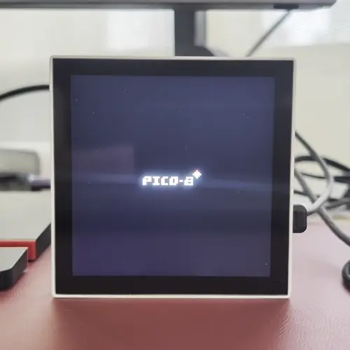

# How to Use p3a (Pixel Pea)

This guide covers everything you need to know to use your p3a pixel art player, from initial setup to advanced features.

## Table of Contents

1. [Initial Setup](#initial-setup)
2. [Preparing Artwork](#preparing-artwork)
3. [Touch Controls](#touch-controls)
4. [Wi-Fi Setup](#wi-fi-setup)
5. [Web Interface](#web-interface)
6. [REST API](#rest-api)
7. [USB SD Card Access](#usb-sd-card-access)
8. [Firmware Updates](#firmware-updates)
9. [Device Registration](#device-registration)
10. [Makapix Club Features](#makapix-club-features)
11. [PICO-8 Monitor](#pico-8-monitor-optional)

---

## Initial Setup

### What you need

- Waveshare ESP32-P4-WIFI6-Touch-LCD-4B board
- USB-C data cable (not a charging-only cable)
- microSD card
- Some pixel art files (WebP, GIF, PNG, or JPEG)

### First-time setup

1. **Flash the firmware** if you haven't already. See [flash-p3a.md](flash-p3a.md) for instructions.
2. **Prepare your microSD card** with artwork (see [Preparing Artwork](#preparing-artwork) below).
3. **Insert the microSD card** into the slot on the board.
4. **Connect power** via USB-C. The device will boot and start the Wi-Fi setup process.
5. **Configure Wi-Fi** by following the [Wi-Fi Setup](#wi-fi-setup) instructions.

Once connected to your network, the device will start playing artwork automatically.

---

## Preparing Artwork

### Supported formats

p3a supports these image formats:
- **WebP** (animated and static) — recommended for best quality and compression; supports transparency
- **GIF** (animated and static) — supports transparency
- **PNG** (static) — supports transparency with full alpha channel
- **JPEG** (static)

**Transparency support**: Images with transparent backgrounds or alpha channels are fully supported. The background color behind transparent areas can be configured via the web interface or REST API.

### File organization

The firmware looks for artwork in this order:
1. `/animations` folder on the microSD card (preferred)
2. If that folder is empty or missing, it searches the entire card for a folder containing image files

**Recommended setup:**
1. Create a folder called `animations` on your microSD card
2. Copy your artwork files into that folder
3. Files are played in alphabetical order by filename

### Image guidelines

- **Any aspect ratio works** — non-square images are scaled to fit while preserving the original aspect ratio
- **Small pixel art is upscaled** — a 128×128 image will be scaled up to fill the display
- **Nearest-neighbor scaling** preserves crisp pixel edges
- **Centered display** — artwork is centered on the 720×720 display with configurable background color
- **Transparent artwork** — images with transparency are composited over the configured background color

---

## Touch Controls

The 720×720 touchscreen recognizes these gestures:

| Gesture | Action |
|---------|--------|
| **Tap right half** | Advance to next artwork |
| **Tap left half** | Go back to previous artwork |
| **Swipe up** | Increase brightness |
| **Swipe down** | Decrease brightness |
| **Two-finger rotate** | Rotate screen (clockwise or counter-clockwise) |
| **Long press** | Start device registration (for Makapix Club) |

### Screen Rotation

You can rotate the display to any of four orientations (0°, 90°, 180°, 270°) using a two-finger rotation gesture:

1. **Place two fingers on the screen**
2. **Rotate your fingers** clockwise or counter-clockwise (like turning a dial)
3. **When you rotate ~45°**, the screen rotates 90° in the same direction
4. **The rotation persists** across reboots and is saved automatically

The rotation applies to both animation playback and the UI (registration codes, status messages). This is useful for mounting the device in different orientations or viewing artwork from different angles.

You can also set rotation via the web interface or REST API (see [REST API](#rest-api) below).

### Auto-advance

When idle (no touch or API interaction), the device automatically advances to a random artwork every 30 seconds. This interval is configurable at compile time.

---

## Wi-Fi Setup

### First boot / new network

If the device can't connect to a saved network, it starts a captive portal:

1. **Connect to the Wi-Fi network** `p3a-setup` from your phone or computer
2. **A setup page should open automatically.** If not, open `http://p3a.local/` or `http://192.168.4.1` in your browser
3. **Enter your Wi-Fi credentials** (SSID and password)
4. **Click "Save & Connect"**
5. The device reboots and connects to your network

### After connection

Once connected, you can access the device at:
- **mDNS**: `http://p3a.local/` (works on most networks)
- **IP address**: Check your router's DHCP client list if mDNS doesn't work

---

## Web Interface

Open `http://p3a.local/` in any browser on the same Wi-Fi network to access the web dashboard.

The web interface provides:
- **Device status** — current artwork, Wi-Fi info, uptime
- **Playback controls** — next, previous, pause, resume
- **Configuration** — brightness, screen rotation, settings
- **PICO-8 button** (if the feature is enabled in firmware)

> **Note:** The web interface is only accessible on your local network, not over the internet. For remote control, register your device at [dev.makapix.club](https://dev.makapix.club/).

---

## REST API

The same endpoints that power the web interface are available as a JSON API for automation and scripting.

### Get device status

```bash
curl http://p3a.local/status
```

Returns JSON with current state, animation info, Wi-Fi status, uptime, and memory.

### Control playback

```bash
# Advance to next artwork
curl -X POST http://p3a.local/action/swap_next

# Go back to previous artwork
curl -X POST http://p3a.local/action/swap_back

# Pause playback
curl -X POST http://p3a.local/action/pause

# Resume playback
curl -X POST http://p3a.local/action/resume

# Reboot device
curl -X POST http://p3a.local/action/reboot
```

### Screen rotation

```bash
# Get current rotation
curl http://p3a.local/api/rotation

# Set rotation (0, 90, 180, or 270 degrees)
curl -X POST http://p3a.local/api/rotation -H "Content-Type: application/json" -d '{"rotation": 90}'
```

### File management

```bash
# List files on SD card (default p3a root folder: /sdcard/p3a)
# Note: Root folder is configurable via Settings page
# Users set a folder name (e.g., /p3a), system prepends /sdcard automatically
curl "http://p3a.local/files/list?path=/sdcard/p3a/animations"
```

---

## USB SD Card Access

p3a has two USB-C ports, but only one (the High-Speed port) works as a USB storage device.

### To access the microSD card from your computer:

1. **Connect a USB-C cable** from the HS port to your computer
2. **The microSD card appears as a removable drive**
3. **Copy, delete, or organize files** as needed
4. **Eject the drive** before disconnecting

### Important notes

- While connected as USB storage, the SD card is locked for the device
- The currently playing animation continues, but you can't change artwork
- Normal operation resumes after disconnecting the USB cable
- Works with computers, smartphones (with USB OTG), and tablets

---

## Firmware Updates

p3a supports Over-the-Air (OTA) firmware updates. After the initial firmware flash via USB-C cable, all subsequent updates can be installed wirelessly through the web interface.

### How OTA updates work

- **First flash**: Use a USB-C cable to flash the initial firmware (see [flash-p3a.md](flash-p3a.md))
- **Subsequent updates**: Download and install wirelessly via the web UI at `http://p3a.local/ota`
- **ESP32-C6 co-processor**: The Wi-Fi module's firmware is updated automatically when needed

### Automatic update checks

- The device checks for updates every 2 hours while connected to Wi-Fi
- Updates are **never installed automatically**—you always approve updates manually
- A notification appears on the main web page when an update is available

### Installing an update

1. **Open the web interface** at `http://p3a.local/`
2. **Look for the update notification** (green banner) if an update is available
3. **Click the notification** or go to `http://p3a.local/ota`
4. **Review the available version** and release notes
5. **Click "Install Update"** and confirm
6. **Wait for the update to complete**—progress is shown on both the device screen and web interface
7. **The device reboots automatically** when the update is complete

> **Important:** Do not power off the device during an update. The update process takes 1-2 minutes depending on the firmware size.

### Rollback to previous version

If you need to revert to the previous firmware version:

1. Go to `http://p3a.local/ota`
2. If a previous version is available, a **"Rollback"** button will appear
3. Click **"Rollback to Previous"** and confirm
4. The device reboots with the previous firmware

### Automatic rollback (safety feature)

If the new firmware fails to boot properly 3 times in a row, the device automatically rolls back to the previous working firmware. This prevents "bricking" the device from a bad update.

### REST API for updates

```bash
# Check current update status
curl http://p3a.local/ota/status

# Trigger manual update check
curl -X POST http://p3a.local/ota/check

# Install available update (if one exists)
curl -X POST http://p3a.local/ota/install

# Rollback to previous version
curl -X POST http://p3a.local/ota/rollback
```

---

## Device Registration

Register your p3a at [dev.makapix.club](https://dev.makapix.club/) to enable cloud features:

- **Send artworks directly** — browse artworks on the website and send them straight to your p3a
- **Remote control** — change artwork, adjust brightness from anywhere
- **Status monitoring** — see your device's online status
- **(Coming soon)** Send reactions to artworks directly from the device

### How to register

1. **Long-press the touchscreen** to start registration mode
2. **A registration code appears** on the display (6 characters)
3. **Go to [dev.makapix.club](https://dev.makapix.club/)** on your phone or computer
4. **Enter the registration code** and link it to your account
5. **The device connects automatically** via secure TLS MQTT

The registration code expires after 15 minutes. If it expires, long-press again to get a new code.

### Security

- Communication uses TLS 1.2+ with mutual certificate authentication (mTLS)
- Each device gets unique client certificates during registration
- Commands are authenticated and encrypted end-to-end

---

## Makapix Club Features

Once your device is registered at [dev.makapix.club](https://dev.makapix.club/), you can use these cloud features:

### Sending artworks to your p3a

1. Browse artworks on [dev.makapix.club](https://dev.makapix.club/)
2. Click on any artwork to view it
3. Click the **"Send to p3a"** button
4. The artwork is sent directly to your device and displayed immediately

Supported formats: WebP, GIF, PNG, and JPEG — including animations and images with transparency.

### Remote control

From the Makapix Club website, you can:
- View your device's current status and artwork
- Navigate between artworks (next/previous)
- Adjust brightness
- Control playback (pause/resume)

---

## PICO-8 Monitor (Optional)

> **Note:** The PICO-8 monitor feature is **disabled by default** in prebuilt firmware to reduce binary size. If you build from source, you can enable it via `idf.py menuconfig` → "Physical Player of Pixel Art (P3A)" → "PICO-8 Monitor" → "Enable PICO-8 monitor feature".

When enabled, p3a can act as a dedicated PICO-8 game display:

### How it works

1. Open `http://p3a.local/` in your browser
2. Click the **"PICO-8"** button
3. Load any `.p8` or `.p8.png` cart file
4. The game streams wirelessly to the device via WebSocket
5. The browser runs a WebAssembly PICO-8 emulator (fake-08)
6. Frames are sent at 30 FPS and upscaled to 720×720

### Auto-timeout

The device automatically exits PICO-8 mode after 30 seconds of inactivity (no frames received) and returns to normal artwork playback.

<p align="center">
  
</p>

---

## Troubleshooting

### Device doesn't appear as `p3a.local`

- mDNS doesn't work on all networks (especially corporate/guest networks)
- Find the device's IP address from your router's DHCP client list
- Access the device at `http://<IP-ADDRESS>/` instead

### Touch not responding

- Clean the screen — the capacitive touch can be affected by moisture or debris
- Restart the device by unplugging and reconnecting power

### Can't connect to Wi-Fi

- Ensure you're entering the correct password
- The device supports WPA2 and WPA3 networks
- If the captive portal doesn't appear, manually browse to `http://p3a.local/` or `http://192.168.4.1`

### Need more help?

Check the [INFRASTRUCTURE.md](INFRASTRUCTURE.md) for technical details, or open an issue on the GitHub repository.

