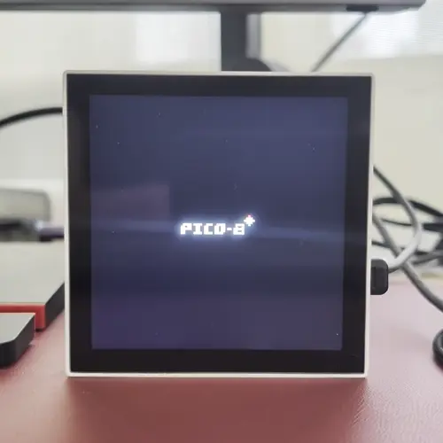

# How to Use p3a

This guide covers everything you need to know to use your p3a pixel art player, from initial setup to advanced features.

> **First time setting up?** Start with the [Quick Start Guide](QUICK-START.md) — it walks through the bare minimum to see art on the screen in about 15 minutes. Come back here for the deeper details.

p3a is built for continuous 24/7 operation. Once it's set up, you can leave it running on a shelf or wall indefinitely — no scheduled reboots, no babysitting required.

## Table of Contents

1. [Initial Setup](#initial-setup)
2. [Wi-Fi Setup](#wi-fi-setup)
3. [Touch Controls](#touch-controls)
4. [Web Interface](#web-interface)
5. [Preparing Artwork](#preparing-artwork)
6. [USB SD Card Access](#usb-sd-card-access)
7. [Giphy Integration](#giphy-integration)
8. [Klipy Integration](#klipy-integration)
9. [Museum Channels (IIIF)](#museum-channels-iiif)
10. [Device Registration](#device-registration)
11. [Makapix Club Features](#makapix-club-features)
12. [PICO-8 Monitor](#pico-8-monitor)
13. [Firmware Updates](#firmware-updates)
14. [SD Card Sizing and Automatic Cleanup](#sd-card-sizing-and-automatic-cleanup)
15. [REST API](#rest-api)
16. [Troubleshooting](#troubleshooting)

---

## Initial Setup

### What you need

- Waveshare ESP32-P4-WIFI6-Touch-LCD-4B board
- USB-C data cable (not a charging-only cable)
- microSD card (4 GB minimum, **FAT32** — p3a can format it for you on-device)
- a small screwdriver
- a computer (Windows, Mac, or Linux) — needed once, for the initial firmware install. Everything after that is wireless.

### First-time setup

1. **Insert the microSD card** into the slot on the board. This requires unscrewing the back plate.
2. **Flash the firmware**. See [flash-p3a.md](flash-p3a.md) for instructions.
3. **Configure Wi-Fi** by following the [Wi-Fi Setup](#wi-fi-setup) instructions below.

> **SD card format:** the card must be FAT32 (or FAT16) — p3a does not read exFAT or NTFS, and cards larger than 32 GB usually ship formatted as exFAT. p3a **never erases or reformats a card unasked**: a card it can't read shows a **"No Usable SD Card"** screen with a **"Format card for p3a"** button — tap it, read the erase warning, and confirm to have p3a format the card as FAT32 and restart. (If a card starts failing later during operation, the same option appears as **"Format SD card"** on the long-press info screen; you can rescue files first over USB — see [USB SD Card Access](#usb-sd-card-access).) To format the card on a computer instead, note that Windows' built-in Format dialog caps FAT32 at 32 GB — use a tool such as [guiformat](http://ridgecrop.co.uk/guiformat.htm) or [Rufus](https://rufus.ie) for larger cards.

Any card from 4 GB up works. Bigger cards hold a bigger artwork cache (fewer re-downloads) — details in [SD Card Sizing and Automatic Cleanup](#sd-card-sizing-and-automatic-cleanup).

---

## Wi-Fi Setup

### First boot / new network

If the device can't connect to a saved network, it starts a captive portal:

1. **Connect to the Wi-Fi network** `p3a-setup` from your phone or computer
2. **A setup page should open automatically.** If not, open `http://p3a.local/` or `http://192.168.4.1` in your browser
3. **Enter your Wi-Fi credentials** (SSID and password)
4. **Click "Save & connect"**
5. The device reboots and connects to your network

### After connection

Once connected, you can access the device at:
- **mDNS**: `http://p3a.local/` (works on most networks)
- **IP address**: Long-press on the screen to show the info screen with the device's IP address

---

## Touch Controls

The 720×720 touchscreen recognizes these gestures:

| Gesture | Action |
|---------|--------|
| **Tap right half** | Advance to next artwork |
| **Tap left half** | Go back to previous artwork |
| **Swipe up** | Pin the current artwork to the active pin list; on Makapix artwork this also sends a Like, on Giphy artwork it registers a click |
| **Swipe down** | Undo the swipe up: unpin the artwork, and revoke the Like if it's a Makapix artwork |
| **Two-finger rotate** | Rotate screen (clockwise or counter-clockwise) |
| **Long press** | Show device info / dismiss overlay |

Pin lists are managed in the Playset Editor (`http://p3a.local/playset-editor`). Swiping on a local SD-card file shows an error indicator — local files can't be pinned or reacted to.

### Screen Rotation

Place two fingers on the screen and rotate them like turning a dial — at roughly 45° of finger rotation, the screen rotates 90° in the same direction. All four orientations (0°, 90°, 180°, 270°) are supported. The rotation applies to both artwork playback and the UI, is saved automatically, and persists across reboots. You can also set rotation via the web interface or [REST API](#rest-api).

### Auto-advance

When idle (no touch or API interaction), the device automatically advances to the next artwork roughly every 30 seconds. The next artwork is chosen by the device's pick-mode setting (recency or random). The interval is configurable via the web interface or REST API.

---

## Web Interface

Open `http://p3a.local/` in any browser on the same Wi-Fi network to access the web dashboard.

The web interface provides:
- **Device status** — current artwork (Wi-Fi info is on the Settings → Network tab; uptime on Settings → System)
- **Playback controls** — next, previous, pause, resume
- **Configuration** — brightness, screen rotation, settings
- **PICO-8 button** (if the feature is enabled in firmware)

> **Note:** The web interface is only accessible on your local network, not over the internet. For remote control, register your device at [makapix.club](https://makapix.club/).

---

## Preparing Artwork

### Supported formats

- **WebP** (animated and static) — recommended for best quality and compression; supports transparency
- **GIF** (animated and static) — supports transparency
- **PNG / APNG** (animated and static) — supports transparency with full alpha channel; `.apng` files are accepted too
- **JPEG** (static)
- **BMP** (static) — all common variants (1/4/8/16/24/32-bit, RLE compression); transparency supported for files with an explicit alpha mask

Images with transparency are composited over a background color configurable via the web interface or REST API.

### File organization

Your own files live inside a single folder on the microSD card. By default:

```
/p3a/animations/
```

The firmware looks **only** in this folder for local artwork — it does not scan the rest of the card. If the folder is missing or empty, the local channel simply shows zero artworks.

The `p3a` root folder is configurable at `http://p3a.local/settings` → **Storage** tab → *SD Card Storage*. Whatever you set there (e.g. `/myart`) becomes the folder p3a uses for **all** of its data — local files, Makapix vault, Giphy/Klipy/museum caches, playlists — and your artwork then belongs in `<your-root>/animations/` instead. Changes require a reboot. Before manually placing files on the card, check that tab to confirm the current root.

Two ways to copy files onto the card:
- **USB** — connect a USB-C cable from the **HS port** to your computer and the SD card appears as a removable drive (see [USB SD Card Access](#usb-sd-card-access))
- **Web upload** — drag and drop files onto the dashboard at `http://p3a.local/`; uploads are saved into `<root>/animations/` automatically

### Image guidelines

- **Any aspect ratio works** — non-square images are scaled to fit while preserving the original aspect ratio
- **Small pixel art is upscaled** — a 128×128 image will be scaled up to fill the display
- **Smart upscaling** — Giphy, Klipy, and museum content uses hardware-accelerated bilinear interpolation for smooth results; everything else (Makapix, local files, pinned artwork) uses nearest-neighbor scaling to preserve crisp pixel edges
- **Centered display** — artwork is centered on the 720×720 display over the configurable background color

---

## USB SD Card Access

p3a has two USB-C ports, but only one (the High-Speed port) works as a USB storage device.

1. **Connect a USB-C cable** from the HS port to your computer
2. **The microSD card appears as a removable drive** — copy, delete, or organize files as needed
3. **Eject the drive** before disconnecting

While connected, the SD card is locked for the device: the screen shows a USB-mode indicator and you can't change artwork until you disconnect. Normal operation resumes automatically after disconnecting. Works with computers, smartphones (with USB OTG), and tablets.

---

## Giphy Integration

p3a can play trending animated GIFs directly from [Giphy](https://giphy.com/). Once configured, Giphy channels appear alongside your Makapix and local artwork channels, and you can mix them in the same playset.

### Getting a Giphy API key

To use Giphy, you need a free API key:

1. Go to [developers.giphy.com](https://developers.giphy.com/) and sign up
2. Create an app and copy the API key
3. Open the p3a settings page at `http://p3a.local/settings#giphy`
4. Paste your API key and click **Save All Giphy Settings**

### Configuring Giphy

The Giphy tab at `http://p3a.local/settings#giphy` lets you customize:

| Setting | Options | Description |
|---------|---------|-------------|
| **Content Rating** | G, PG, PG-13, R | Filters content by age-appropriateness |
| **Refresh Interval** | 1, 2, 4, or 8 hours | How often p3a fetches fresh trending content from Giphy |
| **Cache Size** | 32–500 items | Maximum number of GIFs kept per Giphy channel |

> Rendition (resolution) and format (WebP/GIF) are build-time defaults set via Kconfig (`CONFIG_GIPHY_RENDITION_DEFAULT`, `CONFIG_GIPHY_FORMAT_DEFAULT`); they are not adjustable from the web UI.

### How it works

- p3a periodically fetches trending GIFs from the Giphy API and caches them in the `giphy/` subfolder of your configured SD card root
- GIFs are downloaded on demand as they come up in the rotation, so the first few plays may take a moment — once cached, playback is instant

---

## Klipy Integration

p3a can play GIFs and stickers from [Klipy](https://klipy.com/). Klipy offers three channel kinds — trending, search, and category — each available for both GIFs and stickers, and Klipy channels mix into playsets like any other source.

### Getting a Klipy API key

To use Klipy, you need a free API key:

1. Go to [partner.klipy.com](https://partner.klipy.com/) and sign up
2. Copy your app's API key
3. Open the p3a settings page at `http://p3a.local/settings#klipy`
4. Paste your API key and click **Save All Klipy Settings**

> Test keys are limited to 100 requests per hour. Each request returns up to 50 items, so a 500-item channel takes 10 requests to refresh. Production keys are unlimited.

### Configuring Klipy

The Klipy tab at `http://p3a.local/settings#klipy` lets you customize:

| Setting | Options | Description |
|---------|---------|-------------|
| **Content Rating** | G, PG, PG-13, R | Filters content by age-appropriateness |
| **Format** | GIF or WebP | Downloaded file format — GIF by default; WebP has a smaller download footprint |
| **Refresh Interval** | 1, 2, 4, or 8 hours | How often p3a fetches fresh content from Klipy |
| **Cache Size** | 32–2500 items | Maximum number of artworks kept per Klipy channel |

### How it works

- p3a periodically fetches each channel's listing from the Klipy API and caches artworks in the `klipy/` subfolder of your configured SD card root, split into `gif/` and `sticker/` subtrees
- Artworks are downloaded on demand as they come up in the rotation — once cached, playback is instant

---

## Museum Channels (IIIF)

p3a can play artwork from major museums that publish their collections through the [IIIF Image API](https://iiif.io/api/image/3.0/). Channels are organized by the museum's own facets (collections, departments, sets, ...) and refreshed on a schedule. Seven museums ship today:

| Museum | Facets you can pick |
|---|---|
| **Art Institute of Chicago** | Departments, Classifications, Subjects, Themes, Galleries, Artwork types |
| **Rijksmuseum** | Curated Sets (Rijks's own collection groupings) |
| **Victoria and Albert Museum** | Collections, Categories, Venues |
| **Wellcome Collection** | Work types, Genres, Subjects, Contributors |
| **Statens Museum for Kunst (SMK)** | Collections |
| **Harvard Art Museums** | Classifications, Centuries, Cultures, Periods, Places, Media, Techniques, Work types, Groups, Galleries |
| **Smithsonian** | Museums (Cooper Hewitt, SAAM, NPG, NMAAHC, Hirshhorn, African Art) |

Five of the seven museums need no account or API key. Two do:

- **Harvard Art Museums** — request a free key at [harvardartmuseums.org/collections/api](https://harvardartmuseums.org/collections/api) (delivered by email within a day) and paste it into **Settings → Museums → Harvard Art Museums (API key)**.
- **Smithsonian** — register at [api.data.gov/signup/](https://api.data.gov/signup/) (instant, email-based) and paste the key into **Settings → Museums → Smithsonian (API key)**. One api.data.gov key covers Smithsonian and every other api.data.gov service (NASA, NOAA, etc.). Don't use `DEMO_KEY` — its ~30 req/hour-per-IP cap will throttle the first refresh mid-flight.

Until a key is saved, the corresponding museum entry in the browse modal will prompt you to add one, and any channel you've already created sits dormant — it reactivates the moment a valid key is saved, no need to re-create it.

### Adding a museum channel

1. **Open the Playset Editor** at `http://p3a.local/playset-editor`
2. Open or create a playset and click **Add Channel**
3. Set **Channel Type** to **Museum**
4. A browse modal opens. Pick the museum, then the facet/axis (skipped for Rijks, which is axis-less), then the term you want
5. The modal previews one artwork at a time at 400 px, with **Previous** / **Next** navigation and a title/artist/date caption. The **Add channel** button commits the channel — not the visible artwork. (Rijks previews resolve lazily, so the first thumbnail takes a moment)
6. Save the playset normally

The channel saves under a name like `AIC · Arts of Greece, Rome, and Byzantium` or `V&A · Photographs`, truncated with an ellipsis past 64 characters. The wire encoding is `{museum_id}:{axis}` for the channel name and the facet term id for the identifier — see [finalized-design.md §4.1](art-institutions/finalized-design.md).

### Refresh and download behavior

- **Refresh interval and cache size** are configured in **Settings → Museum** (`http://p3a.local/settings#museum`). Defaults: refresh every 4 days, keep up to 1024 artworks per channel.
- **First refresh** fetches the listing from the museum's API. Image downloads happen lazily as the device rotates through the playset — the first artworks appear within seconds, the rest fill in over the next minutes.
- **Cached files** live under `museum/{museum_id}/` in your SD card root, hash-sharded and shared across all channels of the same museum — two channels referencing the same artwork only pay for it once. Cleanup is automatic (see [SD Card Sizing and Automatic Cleanup](#sd-card-sizing-and-automatic-cleanup)).
- **Rijks artworks** require a "Linked Art walk" (three follow-up HTTP requests per artwork) to discover the actual IIIF identifier. The device does this lazily in the background, so a fresh Rijks channel takes ~50 minutes to fully populate — but the first few artworks appear within seconds.
- **Rate limits** are honored per-museum. AIC publishes a 60-req/minute cap; the others don't publish one but a 429 still engages a cooldown. The cooldown is shared between the device and the browser-side browse modal: if you trigger throttling from the modal, the device also waits.

> A small number of Wellcome terms with very long labels are hidden from the browse modal — see [`docs/deferred/wellcome-long-labels.md`](deferred/wellcome-long-labels.md) for the rationale.

---

## Device Registration

Register your p3a at [makapix.club](https://makapix.club/) to enable cloud features:

- **Send artworks directly** — browse artworks on the website and send them straight to your p3a
- **Remote control** — change artwork, adjust brightness from anywhere
- **Status monitoring** — see your device's online status
- **Send reactions** — swipe up on a Makapix artwork to give it a thumbs-up; swipe down to revoke

### How to register

1. **Open the settings page** at `http://p3a.local/settings`, go to the Makapix tab, and click **Enter Provisioning Mode**
2. **A registration code appears** on the display (6 characters)
3. **Go to [makapix.club](https://makapix.club/)** on your phone or computer
4. **Enter the registration code** and link it to your account
5. **The device connects automatically** via secure TLS MQTT

The registration code expires after 15 minutes. If it expires, click **Enter Provisioning Mode** again to get a new code.

### Security

- Communication uses TLS 1.2 with mutual certificate authentication (mTLS)
- Each device gets unique client certificates during registration
- Commands are authenticated and encrypted end-to-end

---

## Makapix Club Features

Once your device is registered at [makapix.club](https://makapix.club/), you can use these cloud features:

### Sending artworks to your p3a

1. Browse artworks on [makapix.club](https://makapix.club/)
2. Click on any artwork to view it
3. Click the **"Send to p3a"** button
4. The artwork is sent directly to your device and displayed immediately

Supported formats: WebP, GIF, and APNG (animated, with transparency), PNG (still images, with transparency), and JPEG (still images).

### Remote control

From the Makapix Club website, you can:
- View your device's current status and artwork
- Navigate between artworks (next/previous)
- Adjust brightness
- Control playback (pause/resume)

---

## PICO-8 Monitor

p3a can act as a dedicated PICO-8 game display:

1. Open `http://p3a.local/` in your browser and click the **PICO-8** link
2. Load any `.p8` or `.p8.png` cart file
3. The browser runs a WebAssembly PICO-8 emulator (fake-08) and streams frames to the device over WebSocket at up to 30 FPS (adaptive — throttles down under network congestion), upscaled to 720×720

The device automatically exits PICO-8 mode after 30 seconds of inactivity (no frames received) and returns to normal artwork playback.

<p align="center">
  
</p>

---

## Firmware Updates

p3a supports Over-the-Air (OTA) firmware updates. After the initial firmware flash via USB-C cable (see [flash-p3a.md](flash-p3a.md)), all subsequent updates install wirelessly:

- The device checks for updates every 12 hours while connected to Wi-Fi
- Updates are **never installed automatically** — you always approve them
- When an update is available, a green banner appears on the main web page — click it (or go to `http://p3a.local/ota`), review the release notes, click **Install Update**, and confirm
- Progress is shown on both the device screen and the web interface; the device reboots automatically when done
- The ESP32-C6 co-processor's firmware is updated automatically when needed

> **Important:** Do not power off the device during an update. The update takes 1-2 minutes.

### Rollback to previous version

If a previous firmware version is available, a **"Rollback to \<previous version\>"** button appears at `http://p3a.local/ota`. Click it and confirm; the device reboots with the previous firmware.

### REST API for updates

```bash
# Check current update status
curl http://p3a.local/ota/status

# Trigger manual update check
curl -X POST http://p3a.local/ota/check

# Install available update (if one exists)
curl -X POST http://p3a.local/ota/install

# Rollback to previous version
curl -X POST http://p3a.local/ota/rollback
```

---

## SD Card Sizing and Automatic Cleanup

p3a downloads and caches artwork on the SD card, and runs an automatic eviction policy that keeps a slice of the card free at all times. The watermarks scale with card capacity, so any card from 4 GB up works. Under the default settings:

- Eviction kicks in when free space drops below the *trigger* watermark: **10% of the card's capacity** (at least 256 MiB, at most 1 GiB).
- It deletes the least-recently-played cached artwork until free space rises to the *stop* watermark: trigger + **25% of capacity** headroom (at least 512 MiB, at most 4 GiB). The overshoot prevents thrashing — without it, a few downloads would push free space back across the trigger line almost immediately.
- Files newer than 4 hours are never deleted, and your own files in `<root>/animations/` are never touched.

On a 4 GB card this leaves roughly 2.5–3 GiB for cached artwork; on 32 GB and larger cards the caps work out to the classic behavior of keeping ~1–5 GiB free. Bigger cards hold a bigger artwork cache, which means fewer re-downloads — hence the 16+ GB recommendation.

---

## REST API

The same endpoints that power the web interface are available as a JSON API for automation and scripting.

### Get device status

```bash
curl http://p3a.local/status
```

Returns JSON with playback state, firmware version, network info, uptime, free heap, and storage. For current artwork details, see `GET /api/init` or `GET /playsets/active`.

### Control playback

```bash
# Advance to next artwork
curl -X POST http://p3a.local/action/swap_next

# Go back to previous artwork
curl -X POST http://p3a.local/action/swap_back

# Pause playback
curl -X POST http://p3a.local/action/pause

# Resume playback
curl -X POST http://p3a.local/action/resume

# Reboot device
curl -X POST http://p3a.local/action/reboot
```

### Screen rotation

```bash
# Get current rotation
curl http://p3a.local/rotation

# Set rotation (0, 90, 180, or 270 degrees)
curl -X POST http://p3a.local/rotation -H "Content-Type: application/json" -d '{"rotation": 90}'
```

### File management

Files can be uploaded via `POST /upload` (the same multipart endpoint the web UI's drag-and-drop uses), but there are no endpoints for browsing, renaming, or deleting files — use [USB Mass Storage](#usb-sd-card-access) for that.

---

## Troubleshooting

### Device doesn't appear as `p3a.local`

- mDNS doesn't work on all networks (especially corporate/guest networks)
- Find the device's IP address from your router's DHCP client list, or by long-pressing on the screen to show the info screen
- Access the device at `http://<IP-ADDRESS>/` instead

### Touch not responding

- Clean the screen — the capacitive touch can be affected by moisture or debris
- Restart the device by unplugging and reconnecting power

### Can't connect to Wi-Fi

- Ensure you're entering the correct password
- The device supports WPA2 and WPA3 networks
- If the captive portal doesn't appear, manually browse to `http://p3a.local/` or `http://192.168.4.1`

### Need more help?

Check [INFRASTRUCTURE.md](INFRASTRUCTURE.md) for technical details, or open an issue on the GitHub repository.
