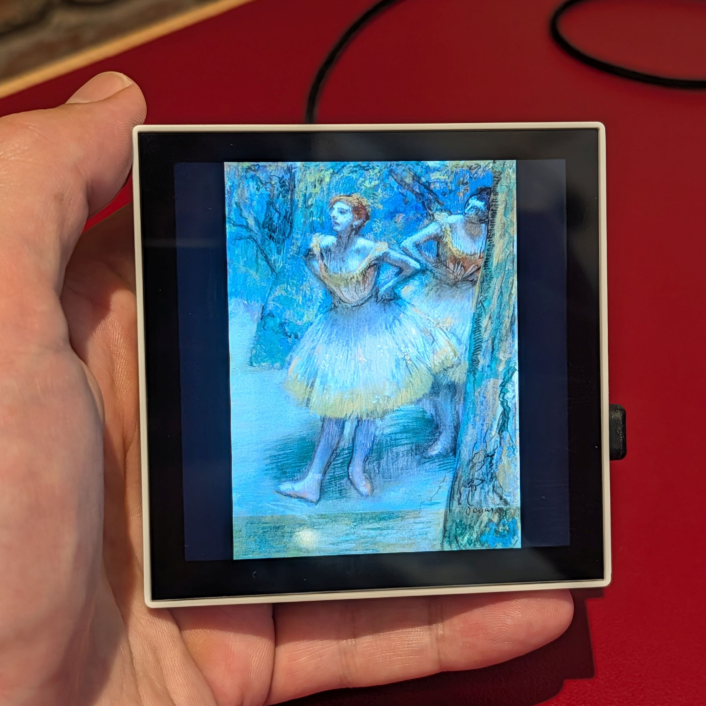
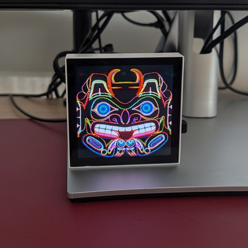
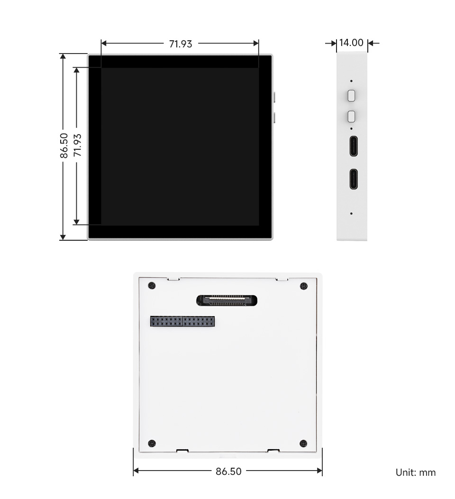
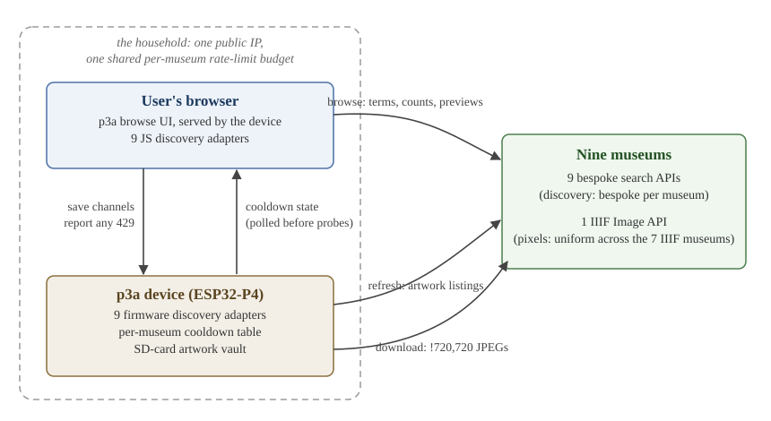
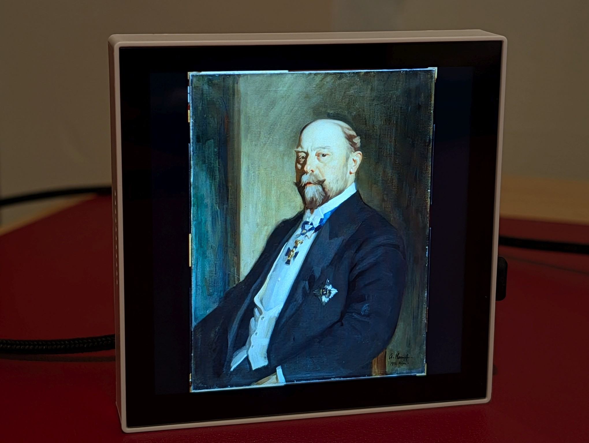

<!-- _class: title -->
<!-- _paginate: false -->



# IIIF from the smallest patron

### What nine museum APIs look like from a 32 MB art frame

**Fabrício Kury**
Biomedical informatician in New York City. Currently works with Medicare claims data analytics at Sparx, Inc.

IIIF Community Call · 14 October 2026
github.com/fabkury/p3a

<!--
- [0:00] Thank the host and whoever invited you from Slack. One sentence on how you got here: posted on IIIF-Discuss in August, someone on Slack invited you.
- Photo: Two Dancers, Degas, Art Institute of Chicago, CC0, requested from AIC's IIIF endpoint at exactly the panel's resolution.
- You are an outsider: never heard of IIIF before May. This talk is a field report from the far edge of the audience.
- Say the takeaway once, up front: the Image API kept its promise; discovery is the gap.
-->

---

# What p3a is



- An open-hardware **desktop art frame**. Apache 2.0.
- Began as a **pixel-art player**: Makapix Club (a pixel-art community I run), Giphy and Klipy, files on the SD card, artwork from a URL.
- Since May 2026 it also plays **museum collections**: seven over the IIIF Image API, two over their own image CDNs.
- No browser, no cloud middleman, no account. The firmware talks to the museum's server directly and decodes the JPEG on the chip.
- Updates itself over the air. Runs on real people's desks.

<!--
- [0:45] "It sits next to you on a desk or a shelf and shows one thing at a time on a good square screen."
- Makapix Club in one sentence, then move on. This audience cares about the museum half.
- "No middleman" is the line the IIIF crowd will like: the frame is a direct client of their servers.
-->

---

# The hardware, in one breath



- Waveshare ESP32-P4-WIFI6-Touch-LCD-4B, **$39.99** at the manufacturer. Under $70 with an SD card and a USB-C supply.
- **ESP32-P4**: dual-core 400 MHz RISC-V. **32 MB PSRAM**, about 768 KB internal SRAM.
- No operating system beyond FreeRTOS. **No browser stack.**
- 4-inch **720 × 720** IPS touchscreen, 24-bit.
- Hardware JPEG decoder, with limits. Wi-Fi 6 via a companion ESP32-C6.
- Firmware in C on ESP-IDF.

<!--
- [1:45] The word "microcontroller" is accurate: it is what the P4 is. Pre-empt pedantry with the spec line.
- The two numbers that matter for the rest of the talk: 32 MB of RAM total, and 720 pixels on a side.
- "Less than most exhibition catalogs."
-->

---

<!-- _class: section -->

# Ninety seconds of the device

<video src="demo.mp4" width="100%" controls muted></video>

<!--
- [2:30] Play demo.mp4 (fallback: images/videos/art-institution-channels/p3a-museums-2026-05-19.mp4). Narrate live over it; cues are in video-shot-list.md.
- Shots: establishing, panel rotating through 3-4 museums, info tap in the web app, browse modal picking a Rijksmuseum set, first artwork landing on the frame.
- Stop the clip at 4:00 regardless.
-->

---

<!-- _class: dense -->

# Channels, playsets, and nine museums

A **channel** is a list of artworks assumed too large to fetch at once: a (museum, facet, term) triple. A **playset** mixes channels at chosen ratios of airtime. The device refreshes each listing every 4 days and keeps 1,024 artworks per channel on the SD card.

| Museum | Facets the user can pick | Key |
|---|---|---|
| Art Institute of Chicago | Departments, Classifications, Subjects, Themes, Galleries, Artwork types | none (see later) |
| Rijksmuseum | Curated sets (193) | none |
| Victoria and Albert Museum | Collections, Categories, Venues | none |
| Wellcome Collection | Work types, Genres, Subjects, Contributors | none |
| Statens Museum for Kunst | Collections | none |
| Harvard Art Museums | Classifications, Centuries, Cultures, Periods, Places, Media, Techniques, Work types, Groups, Galleries | free key |
| Smithsonian | Cooper Hewitt, SAAM, NPG, NMAAHC, Hirshhorn, African Art | free key |
| Cleveland Museum of Art | Departments, Types (CC0 only) | none |
| Minneapolis Institute of Art | Classifications, Departments, Countries, Styles (public domain only) | none |

<!--
- [4:00] The channel abstraction predates IIIF by months; it was built for Giphy and Makapix. The museum feature had to fit it.
- Facets are the museum's own vocabulary. p3a invents no taxonomy.
- The user assembles this in a small web app the device serves to a phone on the same Wi-Fi.
- The device stores no metadata; title and artist are fetched by the browser when you tap the info button.
- [6:00] Move to the IIIF section.
-->

---

<!-- _class: section -->

# One URL template

How p3a uses IIIF

<!--
- [6:00] Section 2 of 5. Five minutes.
-->

---

# The uniform layer

Once an adapter has produced an image identifier, museums stop being different from one another. The firmware builds:

```
{iiif_base}/{identifier}/full/!720,720/0/default.jpg
```

Image API 2, bang-size best fit in 720 × 720, rotation zero, JPEG. It worked, unmodified, on seven independently operated image stacks:

<div class="cols">
<div>

- Chicago's in-house server
- Rijksmuseum, served by **Micrio**
- V&A's **framemark** host
- Wellcome's own service

</div>
<div>

- Copenhagen's **IIPImage**
- Harvard's **URN resolver**, 303 to the real host
- Smithsonian's **IDS**

</div>
</div>

**Fifty-nine lines of shared C** cover everything the standard standardized.

<!--
- [6:15] This is the standards success story. Say it plainly: the people who wrote and implemented the Image API should hear it.
- Seven image stacks, one line of URL construction. Nothing else in this talk is uniform.
- Across ~90 reported-versus-delivered comparisons, !720,720 never cropped: the delivered ratio always equalled the master's.
-->

---

# Three deliberate simplifications

<div class="cols">
<div class="box">

**No `info.json`.**
The panel is 720 × 720. `!720,720` has been honored everywhere. Skipping negotiation halves the request count. Zero misfires since May.

</div>
<div class="box">

**JPEG only.**
Servers serve JPEG far more reliably than WebP, and the chip has a hardware JPEG decoder. Progressive JPEGs (AIC, Harvard) fall back to software.

</div>
</div>

<div class="box" style="margin-top:1em">

**Stream, never buffer.**
32 KB chunks to the SD card, temp file, rename on completion. Two TLS sessions device-wide. A 16 MiB cap in case a server returns the master. A client with 32 MB of RAM does not get to "just download the image and see".

</div>

<!--
- [7:45] Each of these is a choice a browser never has to make.
- info.json: "where advertisement and reality diverged, they diverged the other way" (SMK, later).
- Hardware decoder cannot do progressive at all; 2 of 7 museums serve progressive at this rendition, so every image from those decodes in software.
-->

---

# What a 64-byte budget clarifies

<div class="cols">
<div>

**One artwork record, 64 bytes:** a hash, dimensions, a timestamp, one byte of file type, and **48 bytes for the museum's image identifier**.

**One channel identifier: 33 bytes.**

**Parse buffers,** sized to the most verbose page of each museum, alive for a whole refresh: **192 KB** (Chicago, Rijksmuseum) to **1 MB** (Smithsonian).

</div>
<div>

- Identifier **length** is an interoperability property.
- Identifier **stability** is one too: a drifting id reads as a deletion plus a new artwork.
- **Verbosity is a tax paid in RAM.** 142 bytes per listed artwork at Chicago; about 3,700 at SMK.
- One byte of state is enough. Barely.

</div>
</div>

<p class="muted small">Everything implicit becomes a buffer size, a request count, or a byte.</p>

<!--
- [9:00] This slide exists so that "small client" is concrete for people who think in servers.
- Not all RAM is equal: 768 KB internal versus 32 MB PSRAM; a 1 MB JSON of small nodes would fragment the pool the Wi-Fi path needs and panic the chip, so cJSON is redirected to PSRAM.
- The file-type byte doubles as the Rijksmuseum resolver's state machine: 0xFF not yet resolved, 0xFE given up.
- Sets up two later stories: Library of Congress (id length) and Wellcome (label length).
-->

---

# Being a polite client



- **Identify yourself.** Every request: `p3a/{version} (pub@kury.dev)`.
- **Honor `Retry-After`, remember it, share it.** One cooldown slot per museum; every layer that dials out checks it.
- **One budget per household.** Browser and device share one public IP. The browse UI reports its 429s to the device and waits its turn.
- **Pace even when allowed.** 150-200 ms between pages; two TLS connections; 41-82 calls per refresh, every four days.

<!--
- [10:00] A device that lives in living rooms and refreshes museum APIs on a timer had better be a good citizen.
- The subtle one is the shared budget: browser and device are the same IP to the museum, so they share one cooldown table.
- [11:00] Move to the process section.
-->

---

<!-- _class: section -->

# How it got built

From a research sandbox to firmware

<!--
- [11:00] Section 3 of 5. Five minutes.
-->

---

<!-- _class: dense -->

# Timeline

| Date (2026) | What happened |
|---|---|
| 7 May | **museum-ubi** survey: 18 sources in a capability matrix, per-museum probe scripts and reports. First contact with IIIF. |
| 10-11 May | Design written as five rounds of Q&A. Firmware component built in one day. **Chicago, Rijksmuseum, V&A end to end.** museum-ubi imported into the repo as reference. |
| 12 May | Wellcome, SMK. Gallica deferred (XML). |
| 13-15 May | Library of Congress investigated, scaffolded, removed. **v0.10.0 ships with five museums.** |
| 18-22 May | Harvard, Smithsonian. Seven. |
| 7-9 Aug | Presentation API probes for a longer write-up. |
| 14 Aug | Chicago's image host starts challenging non-browser clients; AIC disabled. |
| 23-24 Aug | Cleveland and Minneapolis: the first **non-IIIF** museums. Nine. |
| 25 Aug | First post to IIIF-Discuss. |

<!--
- [11:15] Four days from "never heard of IIIF" to three museums live; fifteen to seven.
- The speed is the point of the next two slides: a sandbox first, and language models throughout.
-->

---

# museum-ubi, the sandbox

**Unified browsing interface.** A throwaway project to de-risk the p3a feature before committing firmware work.

- Collapse categories, sections, folders, sets, and departments into one concept: **collections**.
- Three features every source must support: **list collections**; **list artworks 200-249 of collection X** (range, not next-cursor); **keyword search**.
- The hard problem was never one integration. It was reconciling heterogeneous capabilities behind one interface. Each source documents what is native, emulated, or unavailable.
- Deliverables: a capability matrix in four tiers, Python probes and a report per museum, a small browser app with one JS adapter per museum and Playwright tests.
- Carried into p3a: the **JS adapters** became the browse UI; the **C adapters** were written from the reports.

<p class="muted small">Its charter said IIIF Presentation was "strongly preferred, the natural carrier" for collections. That preference did not survive contact. More on that shortly.</p>

<!--
- [12:30] The original hard constraint was "must expose artworks via the IIIF Image API". Retired in August when Cleveland shipped with fixed CDN renditions.
- Keyword search, the third feature, is still deferred in p3a. Channels are facet-based.
- Range pagination was a requirement before any museum was looked at; it is what makes the discovery comparison crisp later.
-->

---

<!-- _class: quote -->

# A disclosure

<p class="big">This talk exists because a language model introduced me to a library standard.</p>

- p3a is developed end to end with LLM assistance, in the Cursor IDE and with Claude Code. The design documents are Q&A transcripts.
- When I wanted more content sources, I sent agents to scour the web. One came back with something called the IIIF Image API. I had never heard of it.
- Every technical claim in this talk was verified by me, against live endpoints, and I take responsibility for them.

<!--
- [13:45] Say it straight, once, and move on. No affiliation with Anthropic, Cursor, or any museum.
- The audience deserves to know how one person integrated nine museum APIs in a few months.
-->

---

# Browser and device split the work

<div class="cols">
<div>

**The browser** (on the user's phone or laptop, same Wi-Fi) owns browsing: it queries museum APIs directly, enumerates facets, previews one artwork at a time.

**The device** owns persistence, the 4-day refresh, image download, playback, and cleanup.

The JS adapters mirror the C adapters one to one.

</div>
<div class="box">

**A CORS story.** The Rijksmuseum's curated set list is published over OAI-PMH without CORS headers, so a browser cannot fetch it.

The firmware therefore **bakes the 193-set list into its flash filesystem** and serves it to its own configuration UI.

The device carries a copy of the Rijksmuseum's table of contents wherever it goes, because of CORS headers.

</div>
</div>

<!--
- [14:45] This split mirrors how the browser already talked to makapix.club directly while the firmware handled delivery.
- Cleveland's vocabulary is baked the same way: no facet endpoint, so a full-corpus scan at release time.
- [16:00] Move to the discovery-gap section. This is the argument you want feedback on.
-->

---

<!-- _class: section -->

# Nine discovery layers

The gap above the pixels

<!--
- [16:00] Section 4 of 5. Seven minutes. The heart of the talk.
-->

---

# What the client needs, and does not

Long before IIIF entered the picture, the channel design fixed what a discovery layer must provide. Three primitives, for every museum:

1. **List collections**, in whatever vocabulary the museum uses.
2. **Enumerate a collection with a total count at an arbitrary offset.** "Artworks 400-499 of *Paintings*", not merely "next page". A device caching 1,024 of 735,001 artworks needs both numbers.
3. **Yield an image identifier inline.** No further per-artwork request.

And what it does not need: **metadata**. The device stores none. Title, artist, and date are fetched by the browser, on demand, from the museum. That austerity makes the comparison between museums, and between APIs and standards, unusually crisp.

<!--
- [16:15] These are museum-ubi's three features minus keyword search, plus the inline-id requirement that the 64-byte record forced.
- "Can a small client browse this museum?" reduces to three yes/no questions.
-->

---

# One URL template, nine adapters

<div class="cols">
<div>

| Adapter (C) | Lines |
|---|---|
| Art Institute of Chicago | 849 |
| Rijksmuseum | 645 |
| Smithsonian | 526 |
| Minneapolis Institute of Art | 491 |
| Harvard Art Museums | 477 |
| Cleveland Museum of Art | 475 |
| Wellcome Collection | 438 |
| Statens Museum for Kunst | 406 |
| Victoria and Albert Museum | 399 |
| **Shared IIIF helpers** | **59** |

</div>
<div>

<span class="num">59</span>
lines cover everything the standard standardized.

<span class="num">4,700</span>
lines are the difference between "has an API" and "has the same API".

Each adapter implements the same three primitives against a different search API. Chicago's is the best documented, and still the longest.

</div>
</div>

<!--
- [17:15] Line counts as of September 2026. A crude but honest proxy for how far each API is from the happy path.
- None of these museums is doing anything wrong. Nine reasonable APIs are still nine APIs.
-->

---

<!-- _class: dense -->

# Could Presentation have been the layer? 1. Adoption

Live probes of all seven IIIF museums, 7 August 2026, failures re-verified 9 August (Harvard with a valid key).

| Museum | Collection document | Per-artwork manifest |
|---|---|---|
| Chicago | No. `/iiif/2/collection` is read as an *image* named "collection", redirecting to an `info.json` that 404s | Yes (P2, 2.5 KB), addressed by an id only the search API supplies |
| Rijksmuseum | No. Linked Art + ActivityStreams instead | Yes (Micrio, P3, 1.6 KB, label is an opaque hash) |
| V&A | No (root 404) | Yes (P2, 2.9 KB) |
| Wellcome | **Yes**, a P3 tree with facet axes as sub-collections. Both facet children probed: **503**, both dates | Yes (P3, 107 KB, 36 canvases) |
| SMK | None advertised | Yes (P3, 3.4 KB), served by the search API host |
| Harvard | **Root exists**, one child, "Objects". That child: **500**, with and without a key, both dates | Yes (P2, 9.2 KB) |
| Smithsonian | Not in the documentation | Undocumented |

Two of seven publish a Collection; both broke at exactly the level where enumeration would begin. Six of seven serve manifests, but a manifest is addressed by an id the search API must supply first: **manifests presuppose discovery rather than provide it.**

<!--
- [18:15] Be gentle and precise. These are observations on two dates; you will re-probe the week before the call and say what you found.
- If Wellcome or Harvard staff are on the call: "I would love to be told this was an outage."
- The adoption ground is the weakest of the three on purpose. The next two stand without it.
-->

---

# 2. Specification

Even under perfect adoption, the current spec cannot express what a browsing client asks.

- **Presentation 3.0** scopes itself to what a viewer needs to render an object and says plainly that discovery and harvesting are not what it provides.
- Collections are **ordered trees of references**: no paging construct (2.1's paging was removed), no item counts, no offset access, no facets, no metadata search.
- **Presentation 2.1** had paging, but `total` is optional and navigation is link-following only: sequential traversal with an optional count. The Rijksmuseum cursor walk, in other words.
- **Content Search** searches annotation text *within one object*; descriptive metadata is out of scope.
- **Change Discovery** is a harvester's feed. The model is: *build a search engine, then query your copy.*

A microcontroller cannot be a harvester. It needs the institution's index, queryable in place. That is exactly what every museum's bespoke search API is.

<!--
- [19:45] This is the slide to get right for this room. Quote the scope statements accurately; do not editorialize beyond "scoped for viewers and harvesters".
- "Artworks with images in department X, total, offset 400" is not expressible in 3.0 and only approximable in 2.1 by a full sequential walk.
-->

---

# 3. Economics

Measured the same day. One bespoke search page, with image identifiers inline:

<div class="cols">
<div>

| Museum | Page | Artworks | Bytes / artwork |
|---|---|---|---|
| Chicago | 14 KB | 100 | ~142 |
| Rijksmuseum | 8 KB | 100 | ~78 (ids only) |
| V&A | 101 KB | 100 | ~1,000 |
| Wellcome | 110 KB | 100 | ~1,100 |
| SMK | 185 KB | 50 | ~3,700 |

</div>
<div>

**One manifest:** 1.6 KB (Micrio), 2.5 KB (Chicago), 2.9 KB (V&A), 3.4 KB (SMK), 9.2 KB (Harvard), **107 KB (Wellcome)**.

A single Wellcome manifest weighs as much as an entire hundred-work catalogue page.

</div>
</div>

For one 1,024-artwork channel: **10-20 requests** on the bespoke path versus a tree walk plus **about 1,000 manifest fetches**. A **50-100×** request multiplier for a client that pays TLS per request. And at the end, still no counts and no offsets.

<!--
- [21:00] The Rijksmuseum row: 78 bytes per artwork, but no image id; that costs three JSON-LD hops per artwork at download time, about 15.6 KB each.
- 2.5 MB of manifests at Chicago sizes; over 100 MB at Wellcome sizes.
-->

---

<!-- _class: quote -->

# The conclusion I did not expect

<p class="big">p3a's split, bespoke search for discovery and IIIF for pixels, is not a pragmatic betrayal of the standard. It is the division of labor the IIIF specifications themselves prescribe.</p>

- The Rijksmuseum adapter is the exception that measures the rule: its Linked Art walk **is** the standards-based discovery path, in production, at the price of cursor-only access, emulated offsets, and three extra fetches per artwork.
- The gap between "there should be a standard way to browse collections" and "there is one" is real and known. As they stand, Presentation Collections will not close it.

**This is the claim I would like you to push back on.**

<!--
- [22:00] Pause here. Make the ask explicit: is the conclusion right, and is anything on the roadmap meant to close the gap?
- If there is a Discovery working-group effort you have not seen, this is where you want to hear about it.
- [23:00] Move to idiosyncrasies.
-->

---

<!-- _class: section -->

# Idiosyncrasies

Nine reasonable APIs, observed politely from outside

<!--
- [23:00] Section 5 of 5. Five minutes. Affection first: open-access programs exist because people inside these institutions fought for them.
-->

---

<!-- _class: dense -->

# One line each

| Museum | What a small client learned |
|---|---|
| Chicago | `from + size` on search capped at 1,000 for anonymous callers, undocumented; 403 past about page ten on large facets; asks for a custom `AIC-User-Agent` |
| Rijksmuseum | No image id in listings: three JSON-LD hops per artwork; cursor-only paging; set list over OAI-PMH with no CORS |
| V&A | Venue facet counts are 0 when combined with the has-images filter; page × size capped at 10,000 |
| Wellcome | Genres, subjects, contributors filter by the **label string** (no stable id); labels over 32 characters cannot become channels |
| SMK | `info.json` advertises WebP; server returns 400 for it; `fields=` trimming returns empty items, so 50 records cost ~205 KB |
| Harvard | Without `q=imagepermissionlevel:0`, 57 of the first 100 "has image" records have no usable image URL; the "IIIF server" is a URN resolver |
| Smithsonian | WAF rejects a default User-Agent with **HTTP 200** and an HTML page; `usage:CC0` not indexed; `media` is sometimes an object, sometimes an array; 50 records can exceed 512 KB |
| Cleveland | No IIIF: fixed `_web.jpg` renditions, 750-1,300 px; no facet endpoint, vocabularies baked at release; widths are strings, sometimes empty |
| Minneapolis | No IIIF: S3 buckets at 400, 800, full; raw Elasticsearch in the URL path; past the 10,000 window the endpoint returns `[]` or 500 |

<!--
- [23:15] Do not read the table. Pick two rows and say "every one of these was learned the hard way, and none is documented as a failure."
- The point is the variance: the client pays for each difference in code, in buffer sizes, and in failure modes learned once each.
-->

---

# Rijksmuseum: Linked Art, three hops down

The one museum whose discovery layer is itself standards-based. Nothing in the listing carries an image identifier, so for every artwork the firmware walks:

<div class="box">

**HumanMadeObject → `shows[]` → VisualItem → `digitally_shown_by[]` → DigitalObject → `access_point[]`**, whose URL finally names the Micrio image id. Each hop is a separate JSON-LD fetch.

</div>

- Three hops at listing time would be brutal, so the device **resolves lazily**: one artwork per download pass, interleaved with image downloads.
- Three failures **tombstone** the record until a later refresh re-lists it. One byte of file-type state holds the whole machine.
- A fresh channel takes about 50 minutes to populate; the first artwork appears in seconds.
- Arbitrary offsets are emulated: read the total, wrap, pay the throwaway pages.

<p class="muted small">Every cost here is the honest price of the standards-based path. It works, in production.</p>

<!--
- [24:30] Every cost here is the honest price of the standards path. Say that with respect: the Rijksmuseum did the standards-based thing, and it works.
- The Micrio manifest exists but its label is an opaque hash; it serves neither discovery nor display.
- The file-type byte is the resolver's state machine. A merge must never let an unresolved record overwrite a resolved one, or it orphans the file already on disk.
-->

---

# Smithsonian: the WAF that says 200

<div class="cols">
<div>

Both the search API and the image service sit behind a web application firewall that rejects requests with an empty or default User-Agent.

It rejects them with **HTTP 200** and an HTML page reading **"Request Rejected"**.

For a firmware client, the failure signature is a **JSON parse error on a successful response**. Every signal along the way insisted the request had worked.

</div>
<div class="box">

**The fix costs one line.**

`User-Agent: p3a/1.2.1 (pub@kury.dev)`

Identify yourself, which is exactly what a firewall wants of a well-behaved bot.

The lesson is simple in hindsight. The diagnosis was not.

</div>
</div>

<p class="muted small">Also the largest records of the nine: fifty can exceed half a megabyte, so this adapter alone budgets a 1 MB buffer. The shared demo key cannot survive one refresh; a free api.data.gov key can.</p>

<!--
- [25:30] Among the most misleading failure modes in the whole project.
- This is the evidence for "reject loudly" on the checklist.
-->

---

# SMK: the `info.json` that lies

<div class="cols">
<div>

The friendliest API of the nine: true offset pagination, anonymous, clean JSON, image dimensions right in the listing.

One perfect irony: its image server's **`info.json` advertises WebP** and returns **400** when asked for it.

</div>
<div class="box">

The one museum where capability negotiation would have changed p3a's behavior is the one where negotiation lies.

An `info.json` is a promise, and small clients are the ones that believe it.

</div>
</div>

<p class="muted small">Also: asking the search API to trim response fields returns empty items, so metadata-rich pages must be swallowed whole. About 4 KB per record, 512 KB of buffer for fifty artworks.</p>

<!--
- [26:15] This is why skipping info.json has been safe: divergence goes the other way.
- Keep the affection: SMK is the API you would point a newcomer at.
-->

---

<!-- _class: dense -->

# The ones that could not ship

| Source | Why not, from a 32 MB client |
|---|---|
| **Library of Congress** | Excellent IIIF service, `!720,720` verified. But identifier length is bimodal: 27-47 characters in Prints and Photographs and maps, **67-123 in newspapers and music**, against a 48-byte slot. Whether an item fits depends on which storage subtree it lives in, not on any facet. Many listings carry only a 150 px thumbnail with no way to tell whether the IIIF service exists for the item. |
| **BnF Gallica** | Catalogue search is SRU returning **XML**. The device has no XML parser; ESP-IDF ships none. |
| **Getty** | Enumeration only, via an ActivityStreams collection of ~4.5 M mostly non-artwork entities; no JSON search. The harvester model, exactly what a microcontroller cannot do. |
| **Europeana, DPLA** | Thumbnails capped at 400 px, or thumbnails only; provider-level image URLs too heterogeneous for one adapter. |
| **Smithsonian NMAI, Freer/Sackler** | NMAI's ARK identifiers do not resolve at the IDS IIIF endpoint (0 of the probed `info.json` returned 200). Freer/Sackler: zero Open Access records as of May. |

<!--
- [27:00] Framed as constraints of the device meeting properties of the API, never as verdicts on the institution.
- Library of Congress is the clearest case of identifier length being an interoperability property.
- Cleveland and Minneapolis work only because their baked sizes happen to land near 720 px. IIIF turns that coincidence into a guarantee.
- [28:00] Move to the close.
-->

---

# What would help clients much smaller than a browser

Every item already exists in at least one of the nine APIs. This is curation, not invention.

1. **Inline image identifiers in search results.** One field turns N+1 requests into 1.
2. **True offset pagination with totals.** Cursors force sequential walks; undocumented caps force adapters to learn them empirically.
3. **A filter meaning "displayable image actually included"**, composable, reflecting permissions.
4. **`Retry-After` on every 429.** Clients can only comply with what is stated.
5. **Reject loudly.** A WAF that says 200 turns every downstream parser into a liar.
6. **Advertise only what is served.** An `info.json` is a promise.
7. **Document the sharp edges.** Result-window caps, key-quota floors, permission gates.

<p class="muted small">None of this asks museums to design for microcontrollers. It asks that the properties small clients depend on be recognized as compatibility surface, not implementation detail.</p>

<!--
- [28:00] Read the seven fast; the audience can screenshot. Land on the last sentence.
-->

---

# Two things that are changing

<div class="cols">
<div class="box">

**Museum APIs are mortal.**
NYPL's Digital Collections API retired in August. Smaller ones die quietly. Any client that embeds institutions must plan for their absence; p3a carries a per-source kill switch.

</div>
<div class="box">

**Bot defense is a compatibility issue.**
Since August, Chicago's IIIF host answers non-browser clients with a challenge; the firmware ships with AIC disabled, cached art still playing. A legitimate small client is collateral unless "identify yourself honestly" remains a sufficient answer.

</div>
</div>

Both trends raise the value of everything IIIF got right. The Image API's uniformity is precisely what makes a nine-museum client maintainable by one person and their language models.

<!--
- [28:45] One factual sentence on AIC, no blame. The metadata API is fine; the image host's TLS-fingerprint challenge refuses the device. AIC was the first museum integrated and has the best-documented API.
- If someone runs IIIF behind a WAF, ask them afterwards what a non-browser client should send.
-->

---

# Try it



- **Board:** Waveshare ESP32-P4-WIFI6-Touch-LCD-4B, $39.99, plus a microSD card and a USB-C supply.
- **Flash from the browser:** fabkury.github.io/p3a/web-flasher
- **Source, docs, adapters:** github.com/fabkury/p3a
  Adapters live in `components/art_institution/museums/`; the probes and design documents are in `docs/`.
- Two museums need a free key (Harvard, Smithsonian). The other seven need nothing.
- If your institution's API lists artworks with a count at an offset and carries an image id inline, an adapter is a few hundred lines. Talk to me.

<!--
- [29:20] Thirty seconds. The IIIF crowd includes tinkerers.
-->

---

<!-- _class: title -->

# Thank you

### Is the discovery-gap conclusion right? Is anything on IIIF's roadmap meant to close it?

**Fabrício Kury** · pub@kury.dev · github.com/fabkury/p3a

A longer write-up with all the measurements is under review at the Code4Lib Journal.
Everything shown was observed politely from outside; corrections welcome, especially from the museums named.

<span class="small">These slides: CC BY 4.0.</span>

<!--
- [29:40] Restate the ask in one sentence and stop talking. Fifteen minutes of questions; prepared answers in qa-prep.md.
- If silence: ask whether anyone serves a paged Collection with totals today, in any version.
-->
