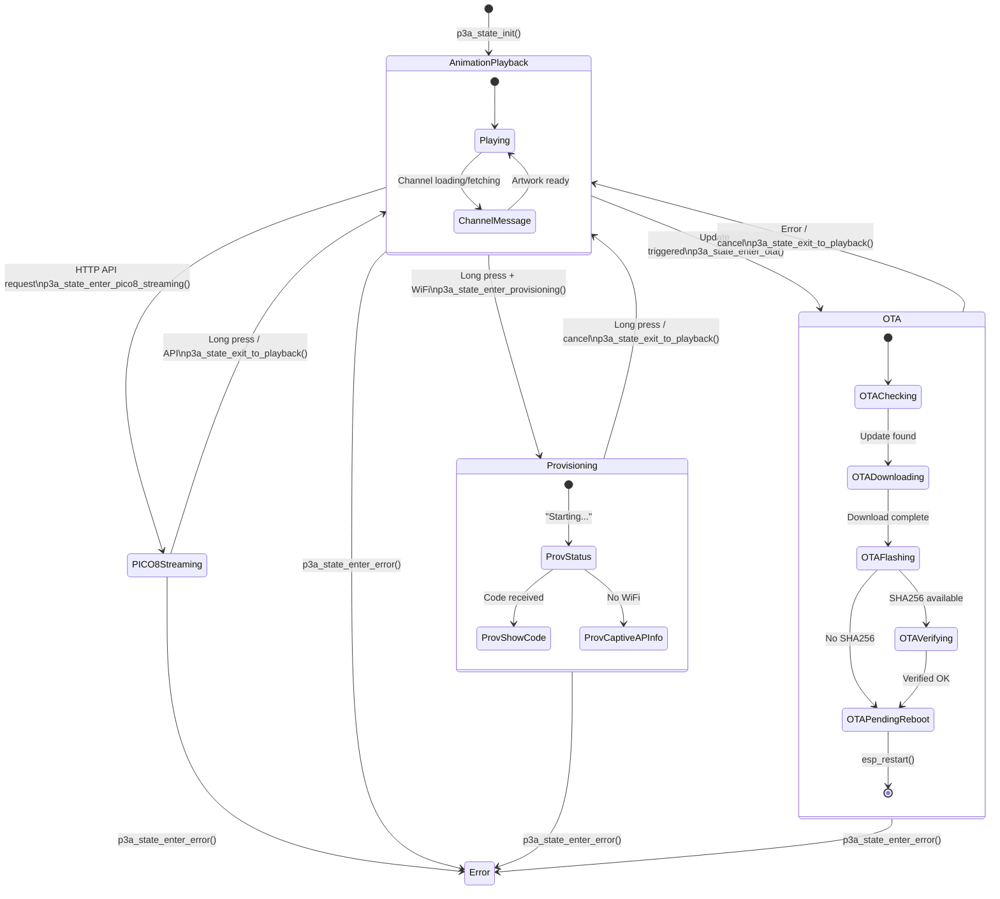

# p3a Core State Machine

The top-level application state machine defined in `components/p3a_core/include/p3a_state.h`. This is the central state that governs what p3a is doing at any given moment.

## States

| State | Enum | Description |
|-------|------|-------------|
| Boot | `P3A_STATE_BOOT` | Boot sequence (initializing subsystems). Defined but not used as initial state at runtime. |
| Animation Playback | `P3A_STATE_ANIMATION_PLAYBACK` | Normal operation: displaying animated pixel art from channels |
| Provisioning | `P3A_STATE_PROVISIONING` | Makapix device registration flow |
| OTA | `P3A_STATE_OTA` | Firmware update in progress |
| PICO-8 Streaming | `P3A_STATE_PICO8_STREAMING` | Real-time PICO-8 frame streaming from USB/WiFi |
| Error | `P3A_STATE_ERROR` | Critical error state |

## Top-Level Diagram

## Entry Guards

Not all transitions are allowed. The `can_enter_state()` function enforces these rules:

| Target State | Allowed From |
|-------------|-------------|
| `ANIMATION_PLAYBACK` | Any state (always allowed) |
| `PROVISIONING` | `ANIMATION_PLAYBACK` only |
| `OTA` | `ANIMATION_PLAYBACK` only |
| `PICO8_STREAMING` | `ANIMATION_PLAYBACK` only |
| `ERROR` | Any state (no restrictions) |

Attempting a disallowed transition returns `ESP_ERR_INVALID_STATE`.

## Sub-States

### Animation Playback (`p3a_playback_substate_t`)

| Sub-State | Enum | Description |
|-----------|------|-------------|
| Playing | `P3A_PLAYBACK_PLAYING` | Normal animation display |
| Channel Message | `P3A_PLAYBACK_CHANNEL_MESSAGE` | Displaying a channel status message |

Channel message types (`p3a_channel_msg_type_t`):
- `NONE` - No message
- `FETCHING` - "Fetching artwork"
- `DOWNLOADING` - "Downloading artwork: X%"
- `DOWNLOAD_FAILED` - "Download failed, retrying"
- `EMPTY` - "Channel empty"
- `LOADING` - "Loading channel..."
- `ERROR` - "Failed to load channel"

### Provisioning (`p3a_provisioning_substate_t`)

| Sub-State | Enum | Description |
|-----------|------|-------------|
| Status | `P3A_PROV_STATUS` | Showing status message |
| Show Code | `P3A_PROV_SHOW_CODE` | Showing 6-character registration code |
| Captive AP Info | `P3A_PROV_CAPTIVE_AP_INFO` | Showing WiFi setup instructions |

### OTA (`p3a_ota_substate_t`)

| Sub-State | Enum | Description |
|-----------|------|-------------|
| Checking | `P3A_OTA_CHECKING` | Checking GitHub for updates |
| Downloading | `P3A_OTA_DOWNLOADING` | Downloading firmware binary |
| Verifying | `P3A_OTA_VERIFYING` | Verifying SHA256 checksum |
| Flashing | `P3A_OTA_FLASHING` | Writing to flash partition |
| Pending Reboot | `P3A_OTA_PENDING_REBOOT` | Flash complete, waiting for reboot |

## Touch Behavior per State

| State | Tap Left/Right | Brightness | Rotation | Long Press |
|-------|---------------|------------|----------|------------|
| Animation Playback | Prev/Next artwork | Adjust | Rotate | Enter Provisioning |
| Provisioning | - | - | - | Exit to Playback |
| OTA | - | - | - | Ignored |
| PICO-8 Streaming | - | - | - | Exit to Playback |

## Render Dispatch per State

Each state has a dedicated render function in `p3a_render.c`:
- **Animation Playback** -> animation player or channel message UI
- **Provisioning** -> uGFX UI (registration code / status)
- **OTA** -> uGFX UI (progress bar / status)
- **PICO-8 Streaming** -> External frame source (no internal rendering)

## Source Files

- `components/p3a_core/include/p3a_state.h` - State type definitions
- `components/p3a_core/p3a_state.c` - State transition logic
- `components/p3a_core/p3a_render.c` - Per-state rendering
- `components/p3a_core/p3a_touch_router.c` - Per-state touch handling
