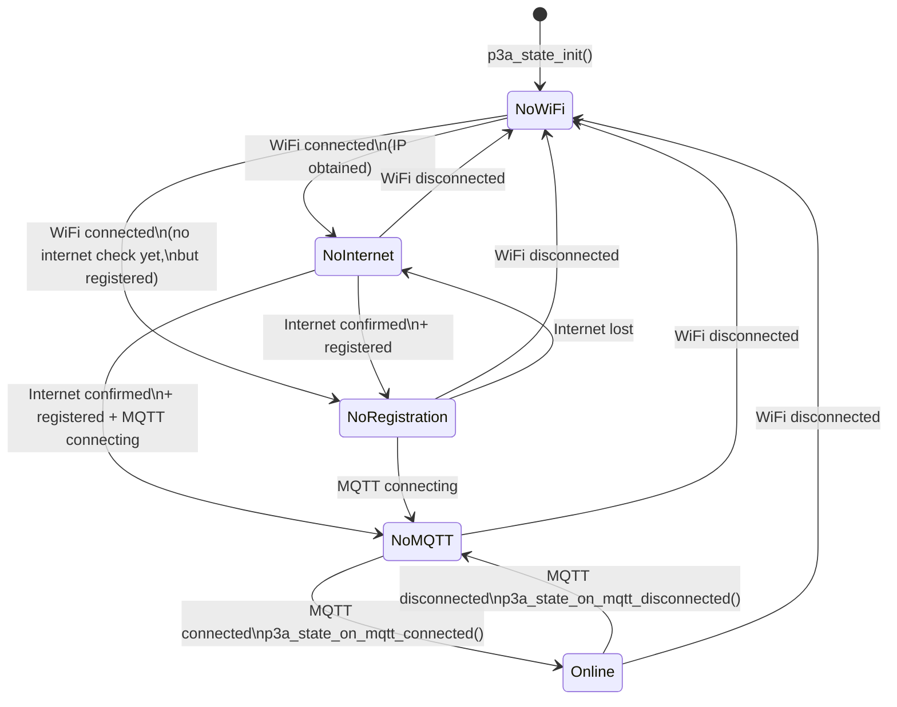

# Connectivity Level State Machine

An **orthogonal state** independent of the global `p3a_state_t`. Tracks the device's connectivity status from "no WiFi" to "fully connected to Makapix Cloud".

Defined in `components/p3a_core/include/p3a_state.h` as `p3a_connectivity_level_t`.

## States

| Level | Enum | Description |
|-------|------|-------------|
| No WiFi | `P3A_CONNECTIVITY_NO_WIFI` | WiFi not connected |
| No Internet | `P3A_CONNECTIVITY_NO_INTERNET` | WiFi connected, but no internet access |
| No Registration | `P3A_CONNECTIVITY_NO_REGISTRATION` | Internet available, device not registered with Makapix |
| No MQTT | `P3A_CONNECTIVITY_NO_MQTT` | Registered, but MQTT broker not connected |
| Online | `P3A_CONNECTIVITY_ONLINE` | Fully connected to Makapix Cloud |

## Diagram

## Transition Triggers

| Trigger Function | Effect |
|-----------------|--------|
| `p3a_state_on_wifi_connected()` | Advances from `NO_WIFI` based on registration/MQTT status |
| `p3a_state_on_wifi_disconnected()` | Drops to `NO_WIFI` |
| `p3a_state_on_mqtt_connected()` | Sets `ONLINE` |
| `p3a_state_on_mqtt_disconnected()` | Drops to `NO_MQTT` (if WiFi still up) or `NO_WIFI` |
| `p3a_state_on_registration_changed()` | Updates level based on current registration status |

## Notes

- This is an **orthogonal dimension**: it changes independently of the global state (ANIMATION_PLAYBACK, PROVISIONING, etc.)
- The connectivity level affects UI decisions (e.g., long press behavior depends on WiFi status)
- Initial level is always `NO_WIFI` regardless of NVS state; it progresses as events arrive

## Source Files

- `components/p3a_core/include/p3a_state.h` - Type definition
- `components/p3a_core/p3a_state.c` - Transition logic
