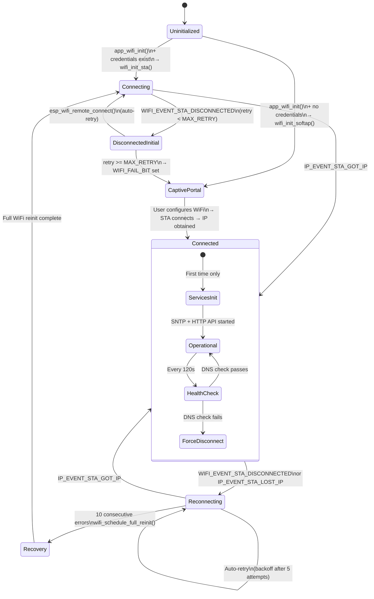

# WiFi Manager State Machine

The WiFi manager uses an **implicit event-driven state machine** — there is no explicit state enum. States are tracked via boolean flags, counters, and FreeRTOS event bits.

Defined in `components/wifi_manager/wifi_manager.c`.

## Implicit States

| State | Tracked By | Description |
|-------|-----------|-------------|
| Uninitialized | Before `app_wifi_init()` | WiFi driver not loaded |
| Connecting | `WIFI_EVENT_STA_START` received | STA started, attempting connection |
| Connected | `IP_EVENT_STA_GOT_IP` received | Got IP, services initialized |
| Disconnected (Initial) | `!s_initial_connection_done` + disconnect | Lost connection before first success |
| Reconnecting | `s_initial_connection_done` + disconnect | Lost connection after initial success, retrying |
| Captive Portal | `s_captive_portal_server != NULL` | AP mode with captive portal active |
| Recovery | `s_reinit_in_progress == true` | Full WiFi reinitialization in progress |

## Diagram



## State Tracking Variables

```c
static bool s_initial_connection_done = false;      // Ever successfully connected?
static bool s_services_initialized = false;         // HTTP API/SNTP started?
static bool s_reinit_in_progress = false;           // Recovery reinit active?
static int  s_retry_num = 0;                        // Current retry count
static int  s_consecutive_wifi_errors = 0;          // Consecutive error counter
static httpd_handle_t s_captive_portal_server;      // NULL = portal inactive
static EventGroupHandle_t s_wifi_event_group;       // CONNECTED_BIT / FAIL_BIT
```

## Event Handlers

| Event | Source | Action |
|-------|--------|--------|
| `WIFI_EVENT_STA_START` | ESP-IDF WiFi | Calls `esp_wifi_remote_connect()` |
| `WIFI_EVENT_STA_DISCONNECTED` | ESP-IDF WiFi | Retry or fail; emit `P3A_EVENT_WIFI_DISCONNECTED` |
| `IP_EVENT_STA_GOT_IP` | ESP-IDF IP | Reset counters; init services; emit `P3A_EVENT_WIFI_CONNECTED` |
| `IP_EVENT_STA_LOST_IP` | ESP-IDF IP | Disconnect MQTT; trigger `esp_wifi_remote_disconnect()` |

## Retry Logic

| Phase | Max Retries | Backoff | Recovery |
|-------|------------|---------|----------|
| Initial connection | `CONFIG_ESP_MAXIMUM_RETRY` | None | Falls back to Captive Portal |
| Persistent reconnection | Unlimited | 5s delay after 5 quick retries | Continues indefinitely |
| Consecutive errors | 10 | N/A | Full WiFi reinit (driver restart) |

## Health Monitoring

- **Interval**: 120 seconds (`s_wifi_health_interval_ms`)
- **Check**: DNS reachability test (`getaddrinfo("google.com")`)
- **Action**: If DNS fails, forces disconnect → triggers reconnection cycle

## Captive Portal

When credentials are missing or initial connection fails:
1. Starts SoftAP (access point mode)
2. Launches HTTP server with captive portal
3. User connects to AP and enters WiFi credentials
4. Portal saved credentials and triggers STA connection
5. On success: captive portal server is stopped

## Source Files

- `components/wifi_manager/wifi_manager.c` - Main implementation
- `components/wifi_manager/include/wifi_manager.h` - Public API
