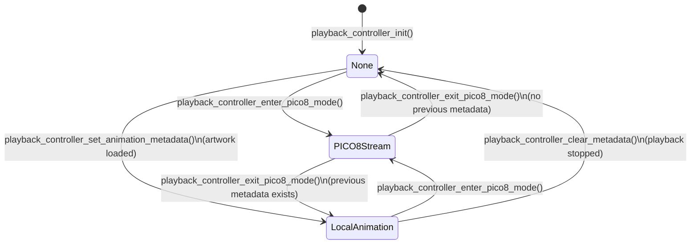

# Playback Controller State Machine

A simple 3-state machine that manages which **render source** is active. Defined in `main/include/playback_controller.h`.

## States

| State | Enum | Description |
|-------|------|-------------|
| None | `PLAYBACK_SOURCE_NONE` | Nothing playing (UI mode or idle) |
| PICO-8 Stream | `PLAYBACK_SOURCE_PICO8_STREAM` | Live PICO-8 frame streaming (WiFi/USB) |
| Local Animation | `PLAYBACK_SOURCE_LOCAL_ANIMATION` | Local animation file playback |

## Diagram

## Transition Details

### Enter PICO-8 Mode
- **Trigger**: HTTP API request or external command
- **Guard**: Not already in PICO-8 mode
- **Actions**:
  1. Preserves current animation metadata (for later resumption)
  2. Calls `p3a_state_enter_pico8_streaming()` (global state)
  3. Calls `pico8_stream_enter_mode()`
  4. Pauses play scheduler auto-swap timer

### Exit PICO-8 Mode
- **Trigger**: HTTP API, touch long press, or external command
- **Guard**: Currently in PICO-8 mode
- **Actions**:
  1. Calls `pico8_stream_exit_mode()`
  2. Calls `p3a_state_exit_to_playback()` (global state)
  3. Resumes local animation if metadata was preserved
  4. Resumes play scheduler auto-swap timer

### Set Animation Metadata
- **Trigger**: `animation_player_render.c` after successful frame swap
- **Guard**: Not in PICO-8 mode
- **Actions**: Sets filepath, loads sidecar metadata, updates source to `LOCAL_ANIMATION`

### Clear Metadata
- **Trigger**: `animation_player.c` when playback stops
- **Guard**: Currently in `LOCAL_ANIMATION` (not PICO-8)
- **Actions**: Frees metadata, sets source to `NONE`

## Integration with Global State

The playback controller coordinates with `p3a_core`:
- PICO-8 entry → `P3A_STATE_PICO8_STREAMING`
- PICO-8 exit → `P3A_STATE_ANIMATION_PLAYBACK`
- Animation metadata changes do not affect global state

## Thread Safety

All transitions are protected by a mutex (`s_mutex`). The `get_source()` function is also mutex-protected for consistent reads.

## Source Files

- `main/include/playback_controller.h` - Type definitions and API
- `main/playback_controller.c` - Implementation
