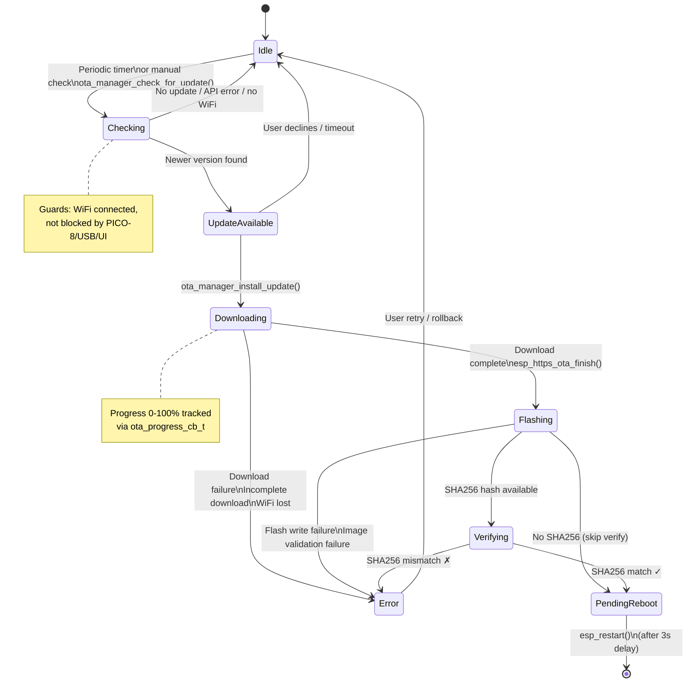

# OTA Manager - Firmware Update State Machine

Manages the firmware over-the-air update lifecycle. Defined in `components/ota_manager/include/ota_manager.h` as `ota_state_t`.

## States

| State | Enum | Description |
|-------|------|-------------|
| Idle | `OTA_STATE_IDLE` | No update activity |
| Checking | `OTA_STATE_CHECKING` | Querying GitHub API for updates |
| Update Available | `OTA_STATE_UPDATE_AVAILABLE` | New version found, awaiting user action |
| Downloading | `OTA_STATE_DOWNLOADING` | Downloading firmware binary |
| Verifying | `OTA_STATE_VERIFYING` | Verifying SHA256 checksum |
| Flashing | `OTA_STATE_FLASHING` | Writing to flash partition |
| Pending Reboot | `OTA_STATE_PENDING_REBOOT` | Flash complete, reboot required |
| Error | `OTA_STATE_ERROR` | Error occurred during any phase |

## Diagram

## Blocking Conditions

The OTA check is skipped when:
- No WiFi connection
- PICO-8 streaming is active
- USB MSC mode is active
- Another check is already in progress

## Progress Tracking

- **Downloading**: 0-100% based on bytes received vs. content-length
- **Verifying**: 0-100% based on bytes hashed vs. partition size
- **Callbacks**: `ota_progress_cb_t` + unified p3a OTA sub-state render

## Error Recovery

| Error Type | Recovery |
|-----------|----------|
| Download failure | Retry from Idle |
| SHA256 download failure | Retry from Idle |
| Image validation failure | Retry from Idle |
| Flash write failure | Retry from Idle |
| SHA256 mismatch | Retry from Idle |
| WiFi lost during update | Returns to Idle on reconnection |

Additionally, `ota_manager_rollback()` can switch the boot partition back to the previous firmware if the newly flashed image is problematic.

## Periodic Check Timer

- OTA checks run on a periodic timer (`ota_timer_callback`)
- Timer interval is configurable
- Checks are gated by the blocking conditions above

## Integration with p3a Core

- Entering OTA: `p3a_state_enter_ota()` (only from `ANIMATION_PLAYBACK`)
- OTA sub-states (`P3A_OTA_CHECKING`, etc.) are synchronized with `ota_state_t`
- On error/completion: `p3a_state_exit_to_playback()`

## Source Files

- `components/ota_manager/include/ota_manager.h` - State enum and API
- `components/ota_manager/ota_manager.c` - Main OTA logic
