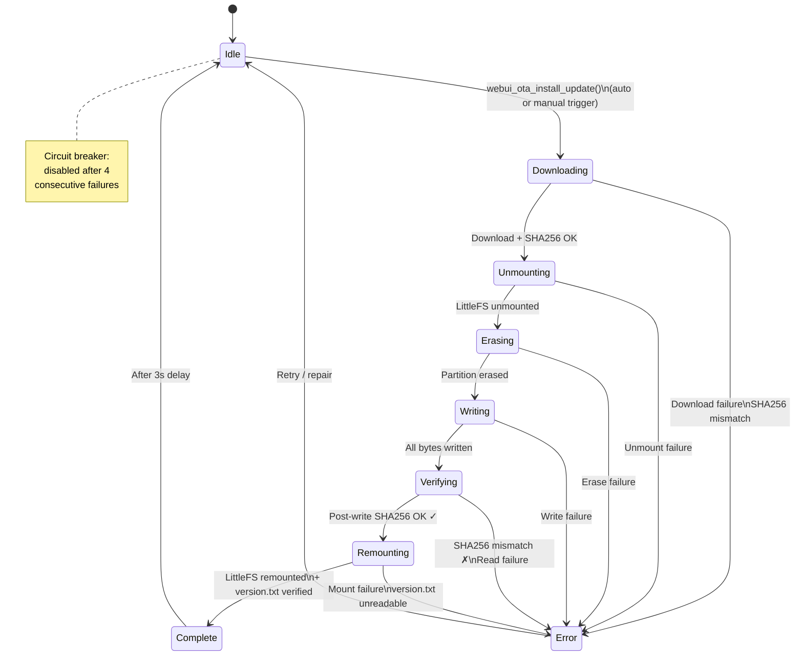

# OTA Manager - Web UI Update State Machine

Manages the Web UI (LittleFS storage partition) over-the-air update lifecycle. Defined in `components/ota_manager/include/ota_manager.h` as `webui_ota_state_t`.

This is separate from the firmware OTA — it updates the web interface assets stored on the LittleFS partition.

## States

| State | Enum | Description |
|-------|------|-------------|
| Idle | `WEBUI_OTA_STATE_IDLE` | No web UI update activity |
| Downloading | `WEBUI_OTA_STATE_DOWNLOADING` | Downloading `storage.bin` from GitHub |
| Unmounting | `WEBUI_OTA_STATE_UNMOUNTING` | Unmounting LittleFS filesystem |
| Erasing | `WEBUI_OTA_STATE_ERASING` | Erasing storage partition |
| Writing | `WEBUI_OTA_STATE_WRITING` | Writing downloaded data to partition |
| Verifying | `WEBUI_OTA_STATE_VERIFYING` | Verifying written data (SHA256) |
| Remounting | `WEBUI_OTA_STATE_REMOUNTING` | Remounting LittleFS filesystem |
| Complete | `WEBUI_OTA_STATE_COMPLETE` | Update complete |
| Error | `WEBUI_OTA_STATE_ERROR` | Error occurred during any phase |

## Diagram

## Circuit Breaker (Failure Counter)

To prevent boot loops from a repeatedly failing web UI update:

| NVS Key | Purpose |
|---------|---------|
| `webui_invalid` | Flag: current web UI is known-bad |
| `webui_recover` | Flag: recovery update requested |
| `webui_failures` | Counter: consecutive failure count |

- Failure counter is incremented **before** starting the update (defensive)
- After **4 consecutive failures**, auto-update is disabled
- Manual repair via `webui_ota_trigger_repair()` bypasses the failure counter

## Progress Tracking

- **Downloading**: 0-100% based on bytes received
- **Writing**: 0-100% based on bytes written vs. total
- **Verifying**: 0-100% based on bytes hashed vs. total
- Status messages update per state transition

## Verification Pipeline

The update performs **two SHA256 checks**:
1. **Pre-write**: Downloaded data verified against the `.sha256` file from GitHub
2. **Post-write**: Data read back from flash partition verified against expected hash

This ensures both download integrity and flash write correctness.

## Source Files

- `components/ota_manager/include/ota_manager.h` - State enum
- `components/ota_manager/ota_webui.c` - Web UI OTA logic
