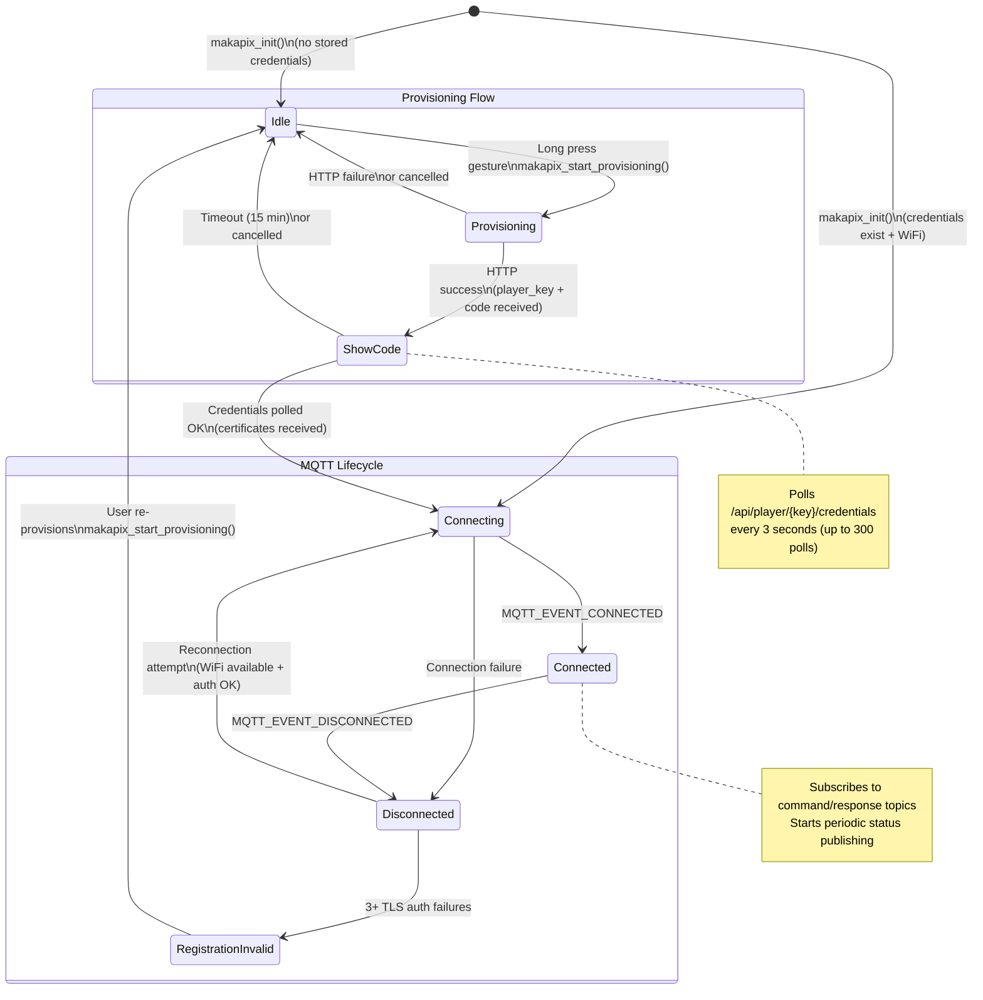
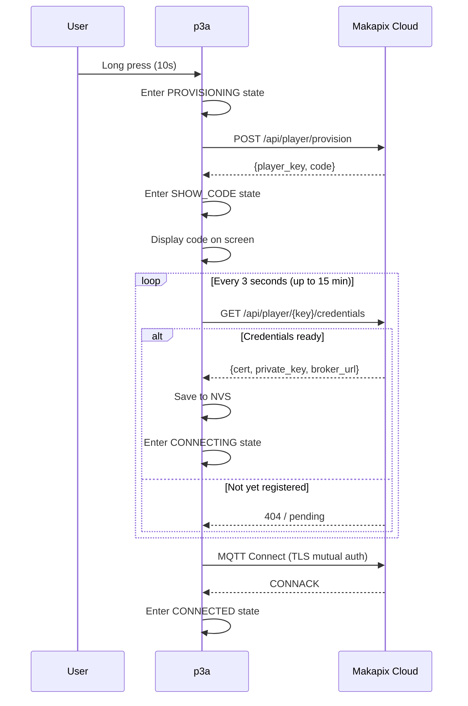

# Makapix State Machine

Manages the Makapix Cloud connection lifecycle: provisioning, MQTT connection, and registration validity. Defined in `components/makapix/makapix.h` as `makapix_state_t`.

## States

| State | Enum | Description |
|-------|------|-------------|
| Idle | `MAKAPIX_STATE_IDLE` | No player_key; waiting for user to initiate provisioning |
| Provisioning | `MAKAPIX_STATE_PROVISIONING` | HTTP provisioning request in progress |
| Show Code | `MAKAPIX_STATE_SHOW_CODE` | Displaying 6-character registration code on screen |
| Connecting | `MAKAPIX_STATE_CONNECTING` | MQTT client connecting to broker |
| Connected | `MAKAPIX_STATE_CONNECTED` | Normal operation; MQTT active |
| Disconnected | `MAKAPIX_STATE_DISCONNECTED` | MQTT lost; reconnection in progress |
| Registration Invalid | `MAKAPIX_STATE_REGISTRATION_INVALID` | Credentials rejected by server (3+ TLS auth failures) |

## Diagram

## Provisioning Flow Detail

## TLS Authentication Failure Detection

The Makapix component tracks consecutive TLS handshake failures:

| Failure Count | Behavior |
|--------------|----------|
| 1-2 | Normal reconnection retry |
| 3+ | Transition to `REGISTRATION_INVALID`; stop reconnecting |

This detects cases where the device's certificate has been revoked or the registration is no longer valid on the server side.

Recovery requires the user to re-provision the device (long press gesture).

## Reconnection Behavior

When in `DISCONNECTED` state:
1. A background reconnection task periodically attempts to reconnect
2. Reconnection requires: WiFi connected + credentials available + auth failures < 3
3. On success: transitions to `CONNECTING` → `CONNECTED`
4. On TLS failure: increments auth failure counter

## Integration with p3a Core

- `makapix_start_provisioning()` triggers `p3a_state_enter_provisioning()`
- MQTT connected/disconnected events update `p3a_connectivity_level_t`
- Provisioning cancel returns to `P3A_STATE_ANIMATION_PLAYBACK`

## Source Files

- `components/makapix/makapix.h` - State enum and public API
- `components/makapix/makapix.c` - Main state logic and provisioning
- `components/makapix/makapix_mqtt.c` - MQTT client management
