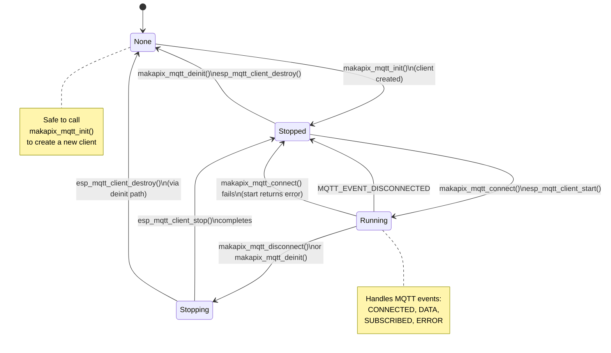

# Makapix MQTT Client State Machine

A low-level state machine managing the ESP-MQTT client lifecycle. Prevents race conditions during connect/disconnect/destroy operations. Defined internally in `components/makapix/makapix_mqtt.c` as `mqtt_client_state_t`.

## States

| State | Enum | Description |
|-------|------|-------------|
| None | `MQTT_CLIENT_NONE` | No client exists (not yet created or fully destroyed) |
| Stopped | `MQTT_CLIENT_STOPPED` | Client created but not started |
| Running | `MQTT_CLIENT_RUNNING` | Client started (connecting or connected) |
| Stopping | `MQTT_CLIENT_STOPPING` | Stop/destroy in progress |

## Diagram



## Guard Conditions

| Operation | Required State | On Wrong State |
|-----------|---------------|----------------|
| `makapix_mqtt_init()` | Any (destroys existing client first) | N/A |
| `makapix_mqtt_connect()` | `STOPPED` | Returns `ESP_ERR_INVALID_STATE` |
| `makapix_mqtt_disconnect()` | `RUNNING` | No-op (safe to call) |
| `makapix_mqtt_deinit()` | Any (stops if running, then destroys) | N/A |

## Relationship to Makapix State Machine

This low-level client state machine operates **underneath** the higher-level `makapix_state_t`:

```
┌──────────────────────────────────┐
│  Makapix State (makapix.c)       │
│  IDLE → PROVISIONING → SHOW_CODE │
│  → CONNECTING → CONNECTED        │
│  → DISCONNECTED                  │
├──────────────────────────────────┤
│  MQTT Client State (mqtt.c)      │
│  NONE → STOPPED → RUNNING        │
│  → STOPPING → NONE               │
└──────────────────────────────────┘
```

- `MAKAPIX_STATE_CONNECTING` corresponds to `MQTT_CLIENT_RUNNING` (start called)
- `MAKAPIX_STATE_CONNECTED` corresponds to `MQTT_CLIENT_RUNNING` + `MQTT_EVENT_CONNECTED` received
- `MAKAPIX_STATE_DISCONNECTED` corresponds to `MQTT_CLIENT_STOPPED` (after disconnect event)

## Thread Safety

All state transitions are protected by `s_mqtt_mutex`. The mutex is taken before checking/changing state and released after the operation completes.

## Source Files

- `components/makapix/makapix_mqtt.c` - Implementation (internal, not exposed in public header)
