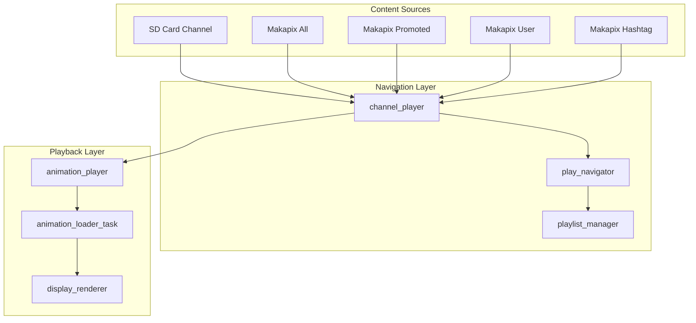
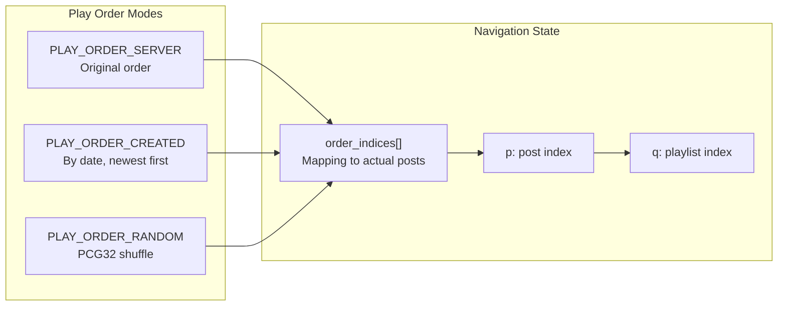
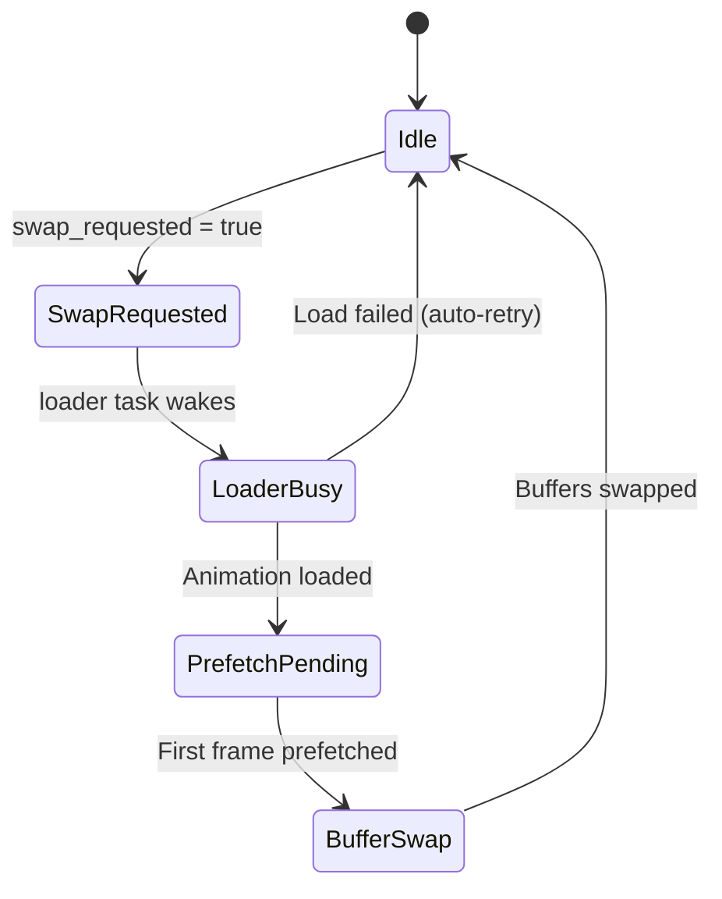
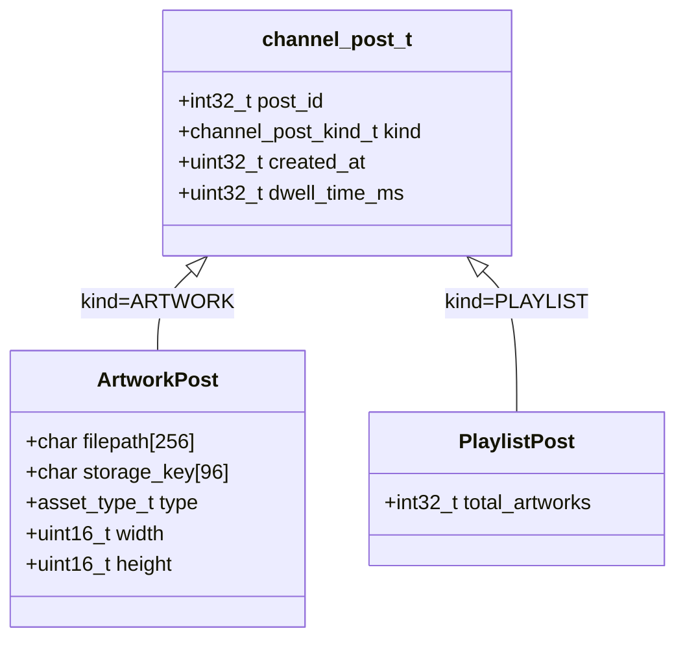
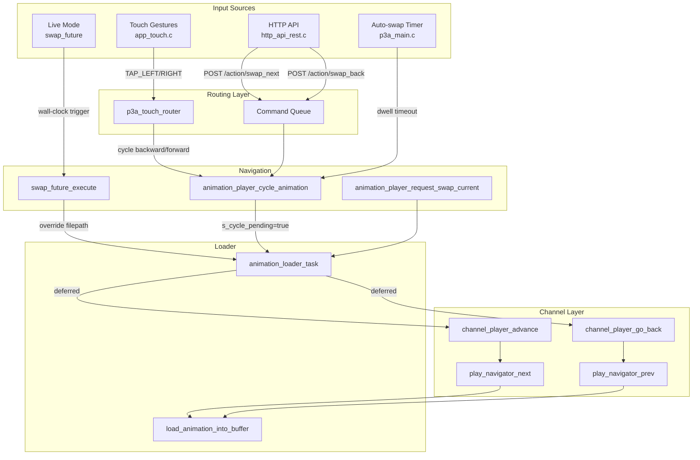
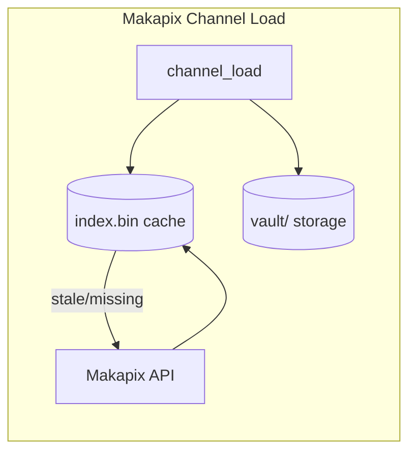
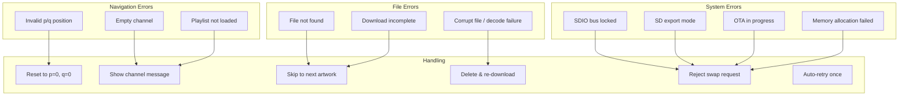

# p3a Artwork Navigation System Analysis

> **Living Document** - Last updated: Dec 27, 2025

## Table of Contents

1. [Overview](#overview)
2. [Main Abstractions](#main-abstractions)
3. [Navigation Data Model](#navigation-data-model)
4. [Command Sources & Flow](#command-sources--flow)
5. [Channel Types & Implementations](#channel-types--implementations)
6. [Error Sources & Handling](#error-sources--handling)
7. [Live Mode Synchronization](#live-mode-synchronization)
8. [Key Files Reference](#key-files-reference)

---

## Overview

p3a's artwork navigation system is built around a layered architecture that supports multiple content sources (SD card, Makapix cloud channels) with unified playback semantics. The system handles:

- **Channels** - Content sources (SD card, Makapix All, Makapix Promoted, user channels, hashtag channels)
- **Posts** - Individual artworks or playlists
- **Artworks** - Image/animation files (WebP, GIF, PNG, JPEG)
- **Navigation** - Moving through content with p/q indexing (post index / playlist artwork index)



---

## Main Abstractions

### 1. `channel_interface` (Abstract Interface)

**File:** `components/channel_manager/include/channel_interface.h`

Defines the polymorphic channel interface that all channel implementations must follow:

| Operation | Description |
|-----------|-------------|
| `load()` | Load channel data into memory |
| `unload()` | Free channel memory |
| `start_playback()` | Begin playback with order/filter |
| `next_item()` | Advance to next item |
| `prev_item()` | Go back to previous item |
| `current_item()` | Get current item without advancing |
| `request_reshuffle()` | Reshuffle random order |
| `request_refresh()` | Refresh from source |
| `get_stats()` | Get channel statistics |
| `get_post_count()` | (Optional) Post-level navigation |
| `get_post()` | (Optional) Get post by index |
| `get_navigator()` | (Optional) Get play navigator |

### 2. `play_navigator` (Navigation State Machine)

**File:** `components/channel_manager/play_navigator.c`

Manages navigation state using **p/q indexing**:

- **p** = Post index in channel (into ordered indices array)
- **q** = In-playlist artwork index (0 for single artworks)



Key state in `play_navigator_t`:

```c
typedef struct {
    channel_handle_t channel;      // Channel being navigated
    char channel_id[64];           // Channel identifier
    play_order_mode_t order;       // Current play order
    uint32_t pe;                   // Playlist expansion (0 = infinite)
    bool randomize_playlist;       // Randomize within playlists
    bool live_mode;                // Live Mode synchronization
    uint32_t global_seed;          // Deterministic random seed
    
    uint32_t p;                    // Post index in channel
    uint32_t q;                    // In-playlist artwork index
    
    uint32_t *order_indices;       // Cached post order mapping
    size_t order_count;            // Number of posts
    
    // Live Mode flattened schedule
    bool live_ready;
    uint32_t live_count;
    uint32_t *live_p;              // Flattened p indices
    uint32_t *live_q;              // Flattened q indices
} play_navigator_t;
```

### 3. `channel_player` (High-Level Player)

**File:** `components/channel_manager/channel_player.c`

Singleton that manages the currently active channel and provides a simplified API:

```c
// Switch between sources
channel_player_switch_to_makapix_channel(makapix_channel);
channel_player_switch_to_sdcard_channel();

// Navigation
channel_player_advance();    // Next artwork
channel_player_go_back();    // Previous artwork

// Query
channel_player_get_current_post(&post);
channel_player_get_post_count();
channel_player_is_live_mode_active();
```

### 4. `animation_player` (Playback Controller)

**File:** `main/animation_player.c`, `main/animation_player_loader.c`

Handles:
- Double-buffered animation loading (front/back buffers)
- Swap request management
- Integration with display renderer
- Deferred navigation (to avoid stack overflow in touch task)



### 5. `playlist_manager` (Playlist Metadata)

**File:** `components/channel_manager/playlist_manager.c`

Manages playlist metadata for multi-artwork posts:

- Fetches playlist content from server
- Caches to SD card
- Provides artwork references by index
- Tracks download status

---

## Navigation Data Model

### Post Types



### Navigation Position

```
Channel: [Post₀, Post₁, Post₂(playlist), Post₃, ...]
              p=0    p=1      p=2          p=3
                              ↓
                    [Art₀, Art₁, Art₂, Art₃]
                     q=0   q=1   q=2   q=3
```

**Current position** is identified by `(p, q)`:
- `p` indexes into `order_indices[]` which maps to actual post indices
- `q` indexes into playlist artworks (0 for single artworks)

---

## Command Sources & Flow

### Command Flow Diagram



### 1. Touch Gestures

**Path:** `app_touch.c` → `p3a_touch_router.c` → `animation_player.c`

```c
// In app_touch.c
p3a_touch_event_t touch_event = {
    .type = (tap_x < screen_midpoint) ? P3A_TOUCH_EVENT_TAP_LEFT 
                                      : P3A_TOUCH_EVENT_TAP_RIGHT
};
p3a_touch_router_handle_event(&touch_event);

// In p3a_touch_router.c (ANIMATION_PLAYBACK state)
case P3A_TOUCH_EVENT_TAP_LEFT:
    app_lcd_cycle_animation_backward();  // → animation_player_cycle_animation(false)
case P3A_TOUCH_EVENT_TAP_RIGHT:
    app_lcd_cycle_animation();           // → animation_player_cycle_animation(true)
```

**Important:** Navigation is **deferred** to the loader task to avoid stack overflow in the touch task (8KB vs 4KB):

```c
void animation_player_cycle_animation(bool forward) {
    // DON'T call channel_player_advance() here!
    // Set flags and let loader task handle it
    s_cycle_pending = true;
    s_cycle_forward = forward;
    s_swap_requested = true;
    xSemaphoreGive(s_loader_sem);
}
```

### 2. HTTP API

**Path:** `http_api_rest.c` → command queue → `animation_player.c`

| Endpoint | Action |
|----------|--------|
| `POST /action/swap_next` | Cycle forward |
| `POST /action/swap_back` | Cycle backward |
| `POST /channel` | Switch channel |
| `PUT /settings/play_order` | Change play order |

```c
// In http_api_rest.c
esp_err_t h_post_swap_next(httpd_req_t *req) {
    api_enqueue_swap_next();  // Queues command
    send_json(req, 202, "{\"ok\":true,\"data\":{\"queued\":true}}");
}
```

### 3. Auto-swap Timer

**Path:** `auto_swap_task` in `p3a_main.c`

```c
static void auto_swap_task(void *arg) {
    while (true) {
        // Check for swap_future first (Live Mode)
        if (swap_future_has_pending()) { ... }
        
        // Check Live Mode continuous scheduling
        if (channel_player_is_live_mode_active()) { ... }
        
        // Normal dwell-based timing
        const TickType_t delay_ticks = pdMS_TO_TICKS(get_current_effective_dwell_ms());
        uint32_t notified = ulTaskNotifyTake(pdTRUE, delay_ticks);
        
        if (notified > 0) continue;  // Timer reset by user
        if (app_lcd_is_animation_paused()) continue;
        
        app_lcd_cycle_animation();  // Auto-advance
    }
}
```

### 4. Live Mode (Synchronized Playback)

**Path:** `live_mode.c` → `swap_future.c` → `animation_player.c`

Live Mode schedules artwork swaps at precise wall-clock times for multi-device synchronization:

```c
// swap_future scheduling
swap_future_t sf = {
    .valid = true,
    .target_time_ms = wall_clock_target,
    .start_time_ms = animation_start_time,
    .start_frame = calculated_frame,
    .artwork = artwork_ref,
    .is_live_mode_swap = true
};
swap_future_schedule(&sf);
```

---

## Channel Types & Implementations

### SD Card Channel

**Files:** `sdcard_channel.c`, `sdcard_channel_impl.c`

- Scans animations directory for supported files
- No playlist support (all posts are single artworks)
- Immediate local access (no downloads)

### Makapix Channels

**Files:** `makapix_channel_impl.c`, `makapix_channel_events.c`, `makapix_channel_refresh.c`

Types:
- `all` - Recent artworks from all users
- `promoted` - Featured/promoted artworks
- `user` - User's own artworks
- `by_user_{sqid}` - Specific artist's artworks
- `hashtag_{tag}` - Artworks with specific hashtag

Features:
- Playlist support (multi-artwork posts)
- Background downloading via `download_manager`
- Persistent index cache (.bin files)
- MQTT-based updates



---

## Error Sources & Handling

### Error Classification



### 1. Invalid Navigation Position

**Handler:** `play_navigator_validate()`

```c
esp_err_t play_navigator_validate(play_navigator_t *nav) {
    if (nav->p >= nav->order_count) {
        nav->p = 0;
        nav->q = 0;
        return ESP_ERR_INVALID_STATE;  // Had to reset
    }
    // ... validate q within playlist
}
```

### 2. Empty Channel

**Handler:** Shows channel message via `p3a_render`

```c
if (channel_player_get_post_count() == 0) {
    p3a_render_set_channel_message("microSD card", P3A_CHANNEL_MSG_EMPTY, -1,
                                   "No artworks found on microSD card.");
}
```

### 3. Missing / Corrupt Files

**Handler:** `animation_loader_task` with auto-retry

```c
// File missing - skip to next
if (file_missing) {
    channel_player_advance();
    discard_failed_swap_request(ESP_ERR_NOT_FOUND, false);
}

// Corrupt vault file - delete and re-download
if (is_vault_file && decode_failed) {
    animation_loader_try_delete_corrupt_vault_file(filepath, err);
    channel_player_advance();
}
```

**Auto-retry safeguard:** Only auto-retries once after a successful swap to prevent infinite loops:

```c
if (s_last_swap_was_successful) {
    s_last_swap_was_successful = false;
    animation_player_request_swap_current();
} else {
    // Auto-retry blocked
}
```

### 4. System Resource Locks

**Handler:** Swap request rejection

```c
esp_err_t animation_player_request_swap_current(void) {
    if (animation_player_is_sd_export_locked()) return ESP_ERR_INVALID_STATE;
    if (animation_player_is_sd_paused()) return ESP_ERR_INVALID_STATE;
    if (sdio_bus_is_locked()) return ESP_ERR_INVALID_STATE;
    // ...
}
```

### 5. Live Mode Failures

**Handler:** `live_mode_recover_from_failed_swap()`

When a Live Mode swap fails, the system scans forward to find the next available artwork:

```c
esp_err_t live_mode_recover_from_failed_swap(void *navigator, 
                                              uint32_t failed_live_index, 
                                              esp_err_t reason);
```

---

## Live Mode Synchronization

Live Mode enables multiple p3a devices to display the same artwork at the same time.

### Timing Model

```
Channel Epoch (Jan 16, 2026) ─────────────────────────────────────►
                             │
                             ├── Art₀ [30s] ──► Art₁ [30s] ──► Art₂ [45s] ──► ...
                             │
Wall Clock Now ──────────────┼─────────────────────────X
                                                       ↑
                                                Current Position
```

### Flattened Schedule

Playlists are "flattened" into a single timeline:

```c
// build_live_schedule() creates:
nav->live_p[idx]  // Post index for each slot
nav->live_q[idx]  // Playlist index for each slot
nav->live_count   // Total flattened items
```

### Swap Future Scheduling

```c
typedef struct {
    bool valid;
    uint64_t target_time_ms;      // When to execute swap
    uint64_t start_time_ms;       // Animation's logical start time
    uint32_t start_frame;         // Frame to start at
    artwork_ref_t artwork;        // What to display
    bool is_live_mode_swap;       // Maintains sync
} swap_future_t;
```

---

## Key Files Reference

| Component | Files | Purpose |
|-----------|-------|---------|
| Channel Interface | `channel_interface.h` | Abstract channel API |
| Play Navigator | `play_navigator.h/c` | p/q navigation state |
| Channel Player | `channel_player.h/c` | Active channel management |
| Playlist Manager | `playlist_manager.h/c` | Playlist metadata |
| Animation Player | `animation_player.c`, `animation_player_loader.c` | Playback & loading |
| Touch Router | `p3a_touch_router.h/c` | State-aware touch handling |
| HTTP API | `http_api_rest.c` | REST endpoints |
| Live Mode | `live_mode.h`, `swap_future.h` | Synchronized playback |
| SD Channel | `sdcard_channel.c`, `sdcard_channel_impl.c` | Local file channel |
| Makapix Channel | `makapix_channel_impl.c` | Cloud channel |
| State Machine | `p3a_state.h/c` | Global app state |

---

## Notes & Observations

### Design Decisions

1. **Deferred Navigation:** Touch handlers defer navigation to loader task to avoid stack overflow (touch task has limited stack)

2. **Double Buffering:** Front/back animation buffers allow seamless transitions

3. **Play Order Preservation:** When changing play order, current position is preserved by finding the same post in the new ordering

4. **Deterministic Random:** PCG32 PRNG with shared seed enables synchronized random playback across devices

### Potential Areas of Interest

1. **Manual swap exits Live Mode:** Any manual navigation (touch, API) disables Live Mode synchronization

2. **Auto-retry limit:** Only one auto-retry after failure to prevent loops

3. **Corrupt file cooldown:** Can only delete one corrupt vault file per hour (safeguard against cascade deletion)

4. **Playlist expansion (pe):** Limits how many artworks from a playlist are included (0 = all)

---

*This document was generated by analyzing the p3a codebase. Updates should be made as the code evolves.*

